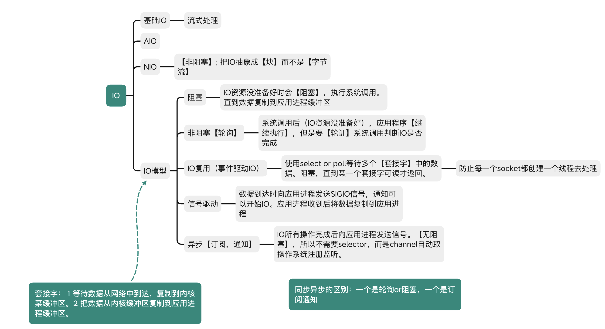
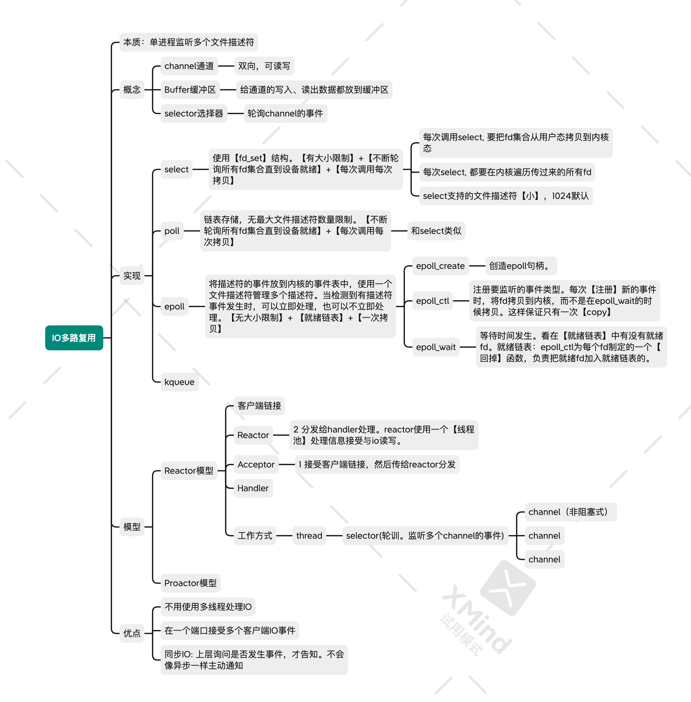

# IO

> 套接字： 1 等待数据从网络中到达，复制到内核某缓冲区。2 把数据从内核缓冲区复制到应用进程缓冲区。



## NIO

### 多路复用


### epoll, select, poll, ...

1. select

- fds: 文件描述符
- rset: 集合，表示哪个fd有数据

```
将文件描述符收集过来交给内核，由内核判断哪一个有数据（如果没有数据，则一直判断，阻塞）。当里面任何一个或者多个有数据时，select会返回。且有数据的fd会在rset中被置位。程序会被返回。

返回后, 判断哪个fd被设置了，读取相应的处理。

亮点：
    fd判断交给了内核。

缺点：
    1. fd_set【大小】限制
    2. fd_set会被置位，所以每次内核处理完回来后需要重新为fd_set赋一个空值。所以每次【fd_set是不可重用】的，每次要重新生命一个新的set
    3. 用户态和内核台的【切换开销】（rset互相传递
    4. 没通知哪个文件描述符有数据，所以每次O(n)遍历哪个fd有数据

```
```java
            
int select(int maxfdp1, fd_set *readset, fd_set *writeset, fd_set *exceptset, const struct timeval * timeout)
// maxfdp1: 待测试的描述字个数
// readset，writeset, exceptest: 让内核测试读、写、异常条件的描述字。 
// timeout: 等待描述字花的时间
```


有数据时：

- 内核将有数据的fd置位。
> fd: rset中对应的那一位，而不是fds中的元素。
- select返回，
- 遍历各个文件描述符看是否有相应的数据来到，并做相应的处理。


2. poll

没用bitmap，而是用了fd

DMA控制器专门用来管理IO请求。单线程处理网络连接不会导致数据**丢失**。


## reference


[1. 参考文章链接](https://www.pdai.tech/md/java/io/java-io-nio-select-epoll.html)

