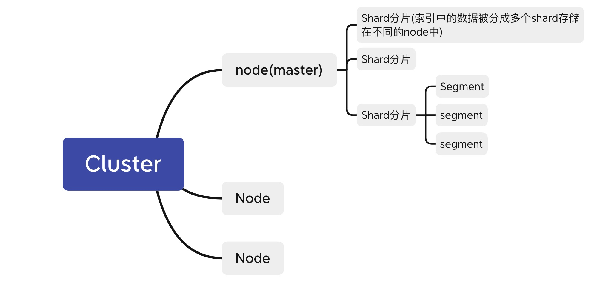

# MySQL 和 Redis 和 MongoDB的不同

#### 1. 存储位置不同

    mysql是关系型数据库，主要用于存放持久化数据，将索引和数据存储在硬盘中，用到才换到内存。读取速度较慢。

    redis是NOSQL，即非关系型数据库，也是缓存数据库，将所有数据存储在内存，读取速度快。

    mongo支持将部分热数据放到内存里。但是和redis的持久化方式不同


#### 2. 容量不同

存储在内存中,存储容量肯定要比磁盘少很多。

#### 3. 存储方式不同

    mysql: 不同引擎上，存储方式不同。

    Redis：key-value类型存储，value具体可以是string, hash, set, list, SortedSet

    mongo key-value存储，文档形式存储，json直接写入方便。
    
Redis是KV 存储系统。 redis支持string, list, set, hash, zset(有序集合)。不仅用于缓存还能用于队列。

#### 4. 应用场景不同

    mysql: 支持事物，保证事物的几个特点。支持复杂的sql

    Redis查询复杂的表关系时不如MySQL和mongo。
    
    mongo: 1 业务需求初始阶段，数据具体格式、结构无法明确定义。可以存放xml, json, bson类型
    2 数据量特别大，并发行特别高。（因此项目中，对于实时埋点数据存放在mongoDB中，有人用上T的内存）mongo存储方式是二进制Binary json, 适合海量存储。
    3 数据结构特别 
    4 mongo分布式。很容易扩展，字段值可以包含其他文档、数组等。
    5 mongo也可以作为缓存：mongo启动后，将数据库中的数据mmap方式映射到内存，因此也可以当做缓存用，比磁盘速度快。
    6 但是mongo占用空间很大。
    7 支持字段索引，比redis查询功能强。

#### 5. 索引不同

# Redis

## redis 为什么快，关系型和非关系型数据库的区别

存放位置不同。读取方式不同。

## Redis持久化

可以将信息从内存放到磁盘，再次加载时将磁盘里的数据放入内存。
方式：RDB(snapshot), AOF(append only file)

## redis 内存管理

数据全在内存，定期写入磁盘。内存不够时，根据LRU算法删除数据

淘汰策略（LRU策略）

    1. 从已经设置过期事件的数据集中，选最近最少使用

    2. 从已经设置过期事件的数据集中，选即将过期的

    3. 从已经设置过期事件的数据集中，选任意数据淘汰

    4. 从已经设置过期事件的数据集中，选择频率最低的

    5. 选择最近最少使用的

    6. 选择频率最低的

    7. 任意数据

    8. 禁止驱逐数据，内存不够就报错。

实现方法：（答双向链表，双向链表+HashMap）

### RDB snapshot快照

快照式的持久化方法。

redis数据持久化时，现将数据写到临时文件，持久化结束后再用临时文件替换上次持久化好的文件。保证完整

是按照一定的策略周期性的将数据保存到磁盘。配置文件中的 save 参数来定义快照的周期

redis主进程进行数据处理，专门folk出一个子进程进行持久化，让主进程不参加IO

### AOF: append only file
只追加，不改写。

将redis执行过的所有写指令记录到AOF文件中，下次redis重新启动时，只要把这些写指令从前到后重复执行一遍就可以数据恢复了。（默认一秒一次）AOF也是先写临时文件，再替换。


日志数据丢失怎么办：redis有redis-check-aof工具，防止追加日志时导致数据丢失。

日志文件太大怎么办：AOF文件大小超过阈值时，redis自动启动AOF文件重写，内容压缩。


### RDB, AOF优缺点：

1. aof数据的恢复完整度更高。rdb保存的有些数据可能不是最新的, 可能丢失数据。

2. AOF文件会越来越大。

3. AOF方式恢复的很慢。

4. 如果不小心执行了FLUSHALL, 对数据进行了误删，导致数据清空，AOF可以恢复。（删除最后一个flushall命令，重启Redis）

## Redis mysql数据一致性

很难保证完全的一致性的。

1. 在更新数据的时候，应该先删除缓存（更新时，先更新数据库，再删除缓存

    原因：复杂的场景下，缓存不单单是从mysql中取出来的值。缓存值如果需要复杂计算，则更新频率高，则浪费性能。

    写数据多的情况下，数据没读到就被更新了，浪费性能。

当然如果非要一致，可以实现读写串行话，传到一个内存队列中。


## 项目中的Redis

### 用来干什么了，用的哪些数据类型

    个人项目中，验证码用到了string, value-string.使用Captcha生成验证码, 利用Redis存储验证码。redis过期时间可以设置，Key是32位的UUID(随机), Value为Captcha的4位随机字母以及数字的集合(随机）。设定Redis过期时间为1min, 即可实现过期验证码的自动失效。

    验证码这里：一个生产者消费者：生产者随机生成32位uuid, value是生成的随机4位字母和数字集合。根据value生成一个image。将key, value存储进redis并设置过期时间。将key-image返回。消费者：判断是否相同。注意的是，每次判断验证码后都失效，是因为拿出来text后，数据就从redis中删除了。

    实习中，redsi用作缓存。
    1. 静态的商品和用户数据：数据类型是key(user id),value是一个hashMap, key是这个id对应的属性名字，value是相关的属性值。2. 一些结果，比如推荐列表，这个虽然是list类型的数据，但是还是用的String（list->jsonString), 难道之后再反序列化


### 有设置超时时间吗？

    设置了
Redis 的超时是怎么实现的？（答了下表结构）

    维护一个过期字典。

Redis 超时的时候它是怎么操作的，是扫整张表吗？（答 惰性删除和定期删除）

    惰性删除:取出来的时候判断是否失效，失效则删除。对内存不好

    定期删除：默认每秒10次过期扫描。1 从过期字典中随机抽取20个key, 2 删除这20个key中过期的key，3 过期键的比例超过25%，重复1 & 2。（扫描时间上线：25ms)

## 一致性哈希如何保证持久性(指每次哈希后都能落到同一个节点)?

    加虚拟节点，使增加删除哈希环上节点，对其他节点的哈希操作影响最小。


## Redis缓存击穿是什么?导致什么后果?有什么防御的措施?


# MongoDB

- 内存数据库，数据放在内存里。
- 基于分布式文件存储的。
- 高负载时，添加更多节点可以保证服务器性能。

## mongoDB存储结构

    key-value格式存储。文档类似json对象，是以一种直观文档的方式存储的。


## 分布式存储数据，怎么定位数据在哪个机器上

分布式存储是什么：一组节点存储数据，节点之间通过网络进行通信。为了完成更多任务协调工作。

> 对与有中心控制节点的存储方式：是从namenode获取该文件的位置。

集群中的机器分成两类：namenode（负责管理获取data在哪个机器上）, datanode(负责实际的管理数据)

> 完全无中心架构中的一致性hash

将设备做成一个哈希环，然后根据数据名称计算出的哈希值映射到哈希环的某个位置，从而实现数据的定位

## mongo的持久化方式

存储在硬盘里，操作的数据通过mmap方式映射到内存区域内。mongo就可以直接在这块区域进行修改。

缺点：mongo在内存中修改数据后，mmap数据flush到硬盘之前，如果系统宕机，数据就丢失了。


# ES

分布式的，提供实时的搜索和分析引擎。把所有操作封装成了http的api`curl -XPUT 'http://ip:port/poems'`

利用分片实现分布式。相当于水平分表，将一个索引中的数据保存在多个分片中。分片又被分配到集群的各个节点Node。ES会自动在Node中迁移分片，从而实现集群规模的扩展等。

master-slave框架。节点对等，选择集群的master, master负责集群信息的改变与同步。
只有建立索引和类型通知master, 其他的读写可以rout到集群的任意节点。

方式：爬取内容-》进行分词-》建立方向索引。



## 存储简单模式：
store entire objects or document。document有多个fields, 为这些fields创建倒排索引并一起存入。

每一个document都保存在多个分片（Shard）中。但是应用程序与index交互而不是分片。

## 一些关键词
- 索引index：放数据的地方，类似于mysql的数据库（全小写）
- 类型type：索引内部逻辑分区。类似mysql中的一张表，内部的逻辑分区，根据需求来讲,例如一个存储用户数据结构，一个存储评论数据的类型。
- 文档：基于Json格式表示。最终的数据。（把数据组织成json格式放进去），针对JSON文档中每一个field都会建立一个对应的倒排索引。

## Lucene存储的数据结构

分成两个部分：字典和倒排表。字典是term的集合。字典中的term指向一个文档链表的集合。是分两部分存储的。倒排表不仅存储了文档编号，还有词频等信息。


## Java API
- Node client
- Transport client

## ES底层写操作

1. create: 用户向某个node提交索引新文档的请求）。node计算document属于哪个shard分片。每个节点都知道shard在哪个node中。因此协调节点将请求发送给该node。

        1.1: node中的主分片收到请求完成索引。
        1.2: 这个请求并行发送给其他副本分片维持更新

2. refresh: 定时将数据写到磁盘。定时写到文件系统缓存，构成segment。30min将segment写入磁盘。translog被删除（translog用来记录两次吸写入数据之间的操作，防止断电丢失）

3. delete：索引不能被删除，只能在del文件中记录，删除时自动过滤。更新维护一个版本号。

## ES底层查询方法

1. 节点收到一个search请求，节点变成协调节点
2. 广播到每个索引中的每个节点的分片，查询是否可以被处理。
3. 分片维护一个优先级队列（因为是排好顺序的）
4. 最后协调节点将所有分片的结果汇总。全局排序

## ES的使用方法

> 要存储一个员工信息表，包含多种信息
### 存储

1. indexing exployee Document: 一个document代表一个employee。（包括id）
2. document的type为exployee
3. type放到某个名字为m_index的index里。
4. 索引放到ES集群中。
``` sql
PUT /m_index/exployee/1（id）
{
    "firstname":"Json",
    "interests":"[1,2]"
}
```
### seach

#### 1. 通过document id:
 `GET /m_index/exployee/1`, 得到的信息就在_source中

#### 2. 通过_search query：

##### 2.1 url写法
`GET /m_index/employee/_search?q=last_name:Smith`, 得到结果在“hits”中

##### 2.2 json写法

1.  match
```sql
GET /m_index/employee/_search
{
    "query":{
        "match":{
            "last_name":"Smitch"
        }
    }
}

```
2.  复杂化搜索
例如运用bool进行和判断or或判断等

3.  全文搜索
**full-text search**（优点）

例如json中about字段存储的是一大段话。但是想搜索这一大段话中的某个词组。则只需要搜索一下代码即可。
返回的结果是出现rock or climbing的所有结果。结果按照排序程度排序并返回。例如出现rock climbing比只出现rock的分数高。

```sql
GET /m_index/employee/_search
{
    "query":{
        "match":{ 
            "about":"rock climbing"
        }
    }
}

```
> match换成match_phase就能支持精准短语搜索。


# kafka
Kafka做什么的?

## kafka几个基础知识

1. Broker ［中间者，代理者]

Kafka集群包含多台服务器，一台Kafka服务器就是一个Broker，一个集群由多个broker组成，一个broker可以有多个topic。broker承担着中间缓存和分发的作用

2. Topic ［主题，类别，话题］
可以理解为是一种队列.用户信息类的消息的topic，我们定义为user-topic

3. producer
向Topic中发送消息的一方

4. consumer
向Topic中拉取／消费消息的一方

5. Replications［备份，复制］
分区的备份，以便容错，分布在其他broker上，每个broker上只能有0个或者1个replications

6. Consumer Group［消费者群组］
消费者群组，是有若干个消费者组成的集体，每个consumer属于一个特定的consumer group

7. Partition ［分区］
Kafka内在就是分布式的，一个broker中可以有多个topic，一个topic可以设置多个partition（分区）。每个partition在物理上对应一个文件夹，文件夹存储所有消息和索引文件。


    redis的LRU策略，保留热数据。或者mongo，使用mmap机制映射到内存里。

HTTPS的机制，加密的流程。

多线程安全怎么保证

    对于mysql，多线程查询时保证一个时间戳，保证安全

    redis: 对用一个key, 多个线程进行改写时，需要设置一个zookeeper实现分布式锁， zookeeper确保一个时间只有一个系统操作key. 别人不允许读写。

接触过 RPC 吗？（了解过，但没实际写过）
