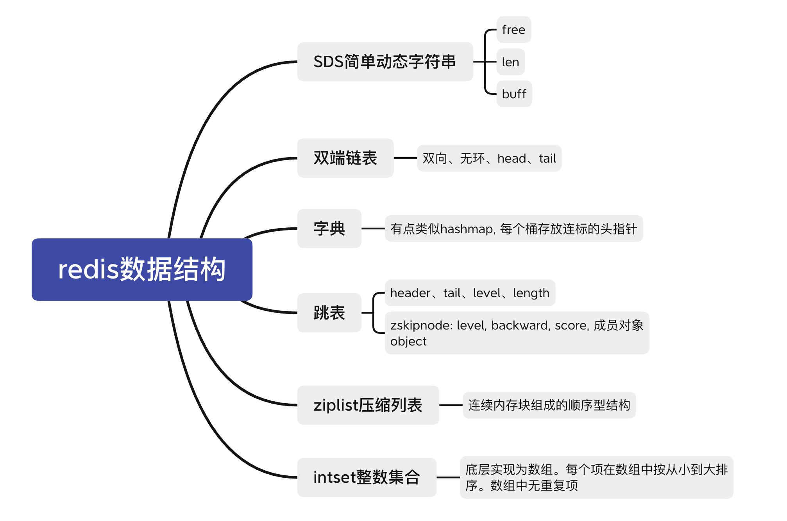
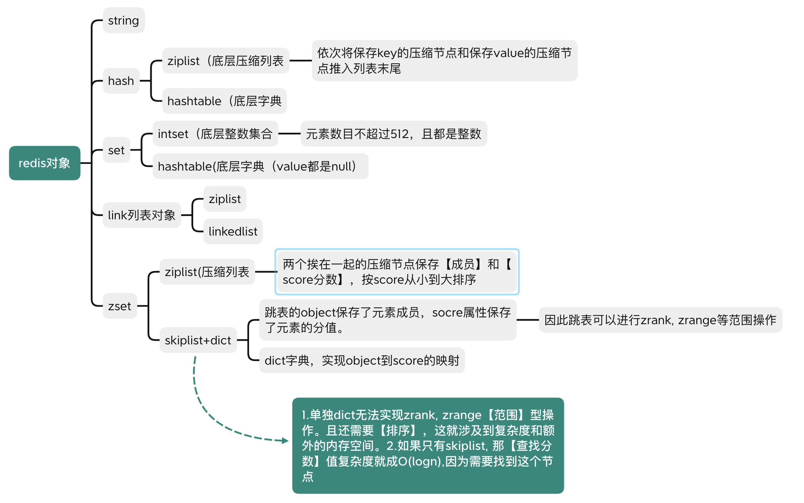

# Redis

## redis 为什么快，关系型和非关系型数据库的区别

存放位置不同。读取方式不同。

## Redis持久化

可以将信息从内存放到磁盘，再次加载时将磁盘里的数据放入内存。
方式：RDB(snapshot), AOF(append only file)

## redis 内存管理

数据全在内存，定期写入磁盘。内存不够时，根据LRU算法删除数据

淘汰策略（LRU策略）

    1. 从已经设置过期事件的数据集中，选最近最少使用

    2. 从已经设置过期事件的数据集中，选即将过期的

    3. 从已经设置过期事件的数据集中，选任意数据淘汰

    4. 从已经设置过期事件的数据集中，选择频率最低的

    5. 选择最近最少使用的

    6. 选择频率最低的

    7. 任意数据

    8. 禁止驱逐数据，内存不够就报错。

实现方法：（答双向链表，双向链表+HashMap）

### RDB snapshot快照

快照式的持久化方法。

redis数据持久化时，现将数据写到临时文件，持久化结束后再用临时文件替换上次持久化好的文件。保证完整

是按照一定的策略周期性的将数据保存到磁盘。配置文件中的 save 参数来定义快照的周期

redis主进程进行数据处理，专门folk出一个子进程进行持久化，让主进程不参加IO

### AOF: append only file
只追加，不改写。

将redis执行过的所有写指令记录到AOF文件中，下次redis重新启动时，只要把这些写指令从前到后重复执行一遍就可以数据恢复了。（默认一秒一次）AOF也是先写临时文件，再替换。


日志数据丢失怎么办：redis有redis-check-aof工具，防止追加日志时导致数据丢失。

日志文件太大怎么办：AOF文件大小超过阈值时，redis自动启动AOF文件重写，内容压缩。


### RDB, AOF优缺点 不同点：

1. aof数据的恢复完整度更高。rdb保存的有些数据可能不是最新的, 可能丢失数据。

2. AOF文件会越来越大。

3. AOF方式恢复的很慢。

4. 如果不小心执行了FLUSHALL, 对数据进行了误删，导致数据清空，AOF可以恢复。（删除最后一个flushall命令，重启Redis）

5. 处理过期不同：
{
    
    AOF：AOF写入：一个键过期，但是没被删除，对于AOF不会有影响。当惰性删除or定时删除后，程序向AOF追加一个DEL命令来删除.AOF重写：检查过期的键。
    
    RDB:创建RDB时：对键检查，过期的不会载入到快照。载入RDB文件时：主服务器模式运行会检查键是否过期，从服务器模式不会。
}

## Redis mysql数据一致性

很难保证完全的一致性的。

1. 在更新数据的时候，应该先删除缓存（更新时，先更新数据库，再删除缓存

    原因：复杂的场景下，缓存不单单是从mysql中取出来的值。缓存值如果需要复杂计算，则更新频率高，则浪费性能。

    写数据多的情况下，数据没读到就被更新了，浪费性能。

当然如果非要一致，可以实现读写串行话，传到一个内存队列中。


## 项目中的Redis

### 用来干什么了，用的哪些数据类型

    个人项目中，验证码用到了string, value-string.使用Captcha生成验证码, 利用Redis存储验证码。redis过期时间可以设置，Key是32位的UUID(随机), Value为Captcha的4位随机字母以及数字的集合(随机）。设定Redis过期时间为1min, 即可实现过期验证码的自动失效。

    验证码这里：一个生产者消费者：生产者随机生成32位uuid, value是生成的随机4位字母和数字集合。根据value生成一个image。将key, value存储进redis并设置过期时间。将key-image返回。消费者：判断是否相同。注意的是，每次判断验证码后都失效，是因为拿出来text后，数据就从redis中删除了。

    实习中，redsi用作缓存。
    1. 静态的商品和用户数据：数据类型是key(user id),value是一个hashMap, key是这个id对应的属性名字，value是相关的属性值。2. 一些结果，比如推荐列表，这个虽然是list类型的数据，但是还是用的String（list->jsonString), 难道之后再反序列化


### 有设置超时时间吗？

    设置了
Redis 的超时是怎么实现的？（答了下表结构）

    维护一个过期字典。

Redis 超时的时候它是怎么操作的，是扫整张表吗？（答 惰性删除和定期删除）

    惰性删除:取出来的时候判断是否失效，失效则删除。对内存不好

    定期删除：默认每秒10次过期扫描。1 从过期字典中随机抽取20个key, 2 删除这20个key中过期的key，3 过期键的比例超过25%，重复1 & 2。（扫描时间上线：25ms)

## 一致性哈希如何保证持久性(指每次哈希后都能落到同一个节点)?

    加虚拟节点，使增加删除哈希环上节点，对其他节点的哈希操作影响最小。


## Redis缓存击穿是什么?导致什么后果?有什么防御的措施?


# Redis基础

redis主要由【dict】【expires】两个字典构成。dict负责键值对，expires保存键值对过期时间。

    expires结构：
    {
        key：指针，指向键对象
        value: longlong过期时间，毫秒为单位的UNIX时间戳
    }

redis键总是一个字符串对象，value可以是任意redis对象类型


## 1 数据结构

《Redis的设计与实现》

redis基于这些数据结构创建了一个对象系统，这个系统包含字符串对象、列表对象、hash对象、集合对象、有序集合对象。

另外。redis还是用了基于引用计数（java是可达分析）的回收机制，程序不在用时，对象所在内存就会释放。

redis对象还有访问时间记录信息，用于计算键的空转时常，优先删除空转时常大的键。



### 1. SDS简单动态字符串

大多情况，String使用了SDS而不是传统的c语言的string。因为保存的string也是key, value形式的，一次key底层是一个SDS, value底层也是一个SDS

> SDS: 简单字符串。simple dynamic string

#### SDS里面包含内容：

1. free: 为未使用的空间分配的字节数， 
2. len:已经分配的字符串的字节数。
3. buf（字节数组）是char类型的数组。（其实不是保存字符，而是保存一系列的【二进制数据】，以空字符串结尾'\0'。


- 修改SDS时候，需要查看分配的字节数目是否符合要求，如果不符合要求，需要先扩展空间。
- SDS按照处理二进制的方式处理buf数组里的数据。

> c：使用n+1长度的字符串表示长度为n的字符串。最后一个元素是空字符。

c字符串不能包含空字符，因为结尾就是\0。因此只能包含无空字符的【文本数据】、图片、饮品、视频这种【二进制数据】不可以。SDS按照处理二进制的方式处理buf数组里的数据。

SDS的优点

    1 保存了字符串的长度，get length时降低复杂度。

    2 安全，缓冲区溢出的杜绝：c语言不记录自身长度， 因此拼接时，可能会溢出。

    3 SDS可以实现空间预分配，和惰性空间释放两种优化策略。SDS内部包含了free区域，尽量减少连续修改（增加）字符串导致【重新分配内存】。字符串缩短的时候也会暂时不修改内存，用free记录这些字节，等待将来的使用。

    4. c的string不能保存空字符串，因为用空字符串判断结尾。但是redis的SDS可以，因为利用len来判断是否结尾。

    5. sds可以保存文本或进制数据，但是c的只能保存文本数据。


### 2. 双端List链表

在redis中的使用情况：
- 保存较长字符串作为【列表键】
- 作为客户端输出缓冲区

redis中的链表是双向的，无环，有len属性对链表节点计数。

### 3. 字典

类似于java中的hashmap： 数组存储key, 桶内是链表，每个节点都有一个next指针。

Redis hash 是一个键值(key=>value)对【集合】。hash 特别适合用于存储对象。

在redis中的使用情况：
- redis数据库底层
- hash键的底层实现，hash键包含的键值对很多or键值对中的元素比较长。

> redis数据库底层使用字典实现的。对数据库的增删改查操作也是基于字典。

rehash干嘛的：在扩展或者缩小容量的时候，rehash重新计算对应的hash值和索引值，

### 4. 跳跃表zskiplist
查找复杂度：平均O(logN)，最坏O(n), 效率和平衡树持平，但是实现起来更简单。

    zskiplist的结构:
    1. header指针
    2. tail指针
    3. level最大层数
    4. length：表中一共多少个node

    zskiplistNode结构：
    1. level
    2. backward 指针，每个表只有一个后退指针，所以每次只能后退一个
    3. score：跳表中节点从小到大排列。
    4. 成员对象
使用：
- zset
- 集群节点中作为内部数据结构

### 5. intset整数集合
**集合键**的底层实现之一。intset底层实现为数组。每个项在数组中按从小到大排序。数组中无重复项。

又一个length()保存了数组的长度。

### 6. ziplist压缩列表

当一个**列表键**只有少量列表项，并且每个列表项要么小整数值，要么是长度短的字符串。

组成：一系列特殊编码的连续内存块组成的顺序型结构。

## 2 对象



## 3 对象回收与对象共享
对象回收：【引用计数】

对象共享：借助引用计数实现。

    1. 将键的value指向同一个现有的值对象
    2. 将共享的值对象的引用计数+1

对象还会记录最后一次被访问的时间，用于计算对象的空转时间

## 4 redis过期

### 4.1 设置过期

EXPIRE， PEXPIRE关键字设置过期

### 4.2 保存过期

过期字典：expires字典保存了所有键的过期时间
{
    key：指针，指向键对象
    value: longlong过期时间，毫秒为单位的UNIX时间戳
}


所以可以通过过期dict里的value和当前unix时间戳比较，判断是否过期。

### 4.3 过期键删除

1. 定时删除：设置定时器timer，在设定key的时候设定。键多时，cpu不友好
2. 惰性删除：获得键的时候，查看过期dict判断是否过期。cpu友好
3. 定期删除：每隔一段时间对数据库进行检查，删除过期键。折中，但是不好设置删除的时长和频率

```
    AOF：AOF写入：一个键过期，但是没被删除，对于AOF不会有影响。当惰性删除or定时删除后，程序向AOF追加一个DEL命令来删除.AOF重写：检查过期的键。
    
    RDB:创建RDB时：对键检查，过期的不会载入到快照。载入RDB文件时：主服务器模式运行会检查键是否过期，从服务器模式不会。
```


