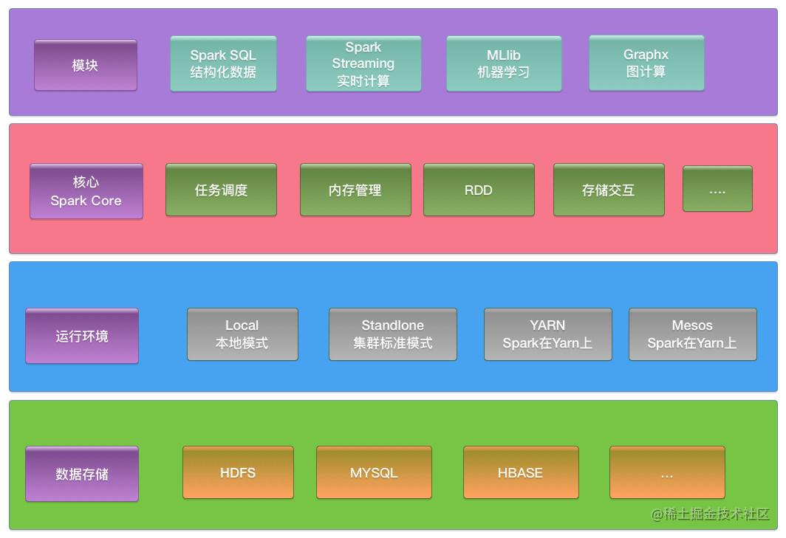
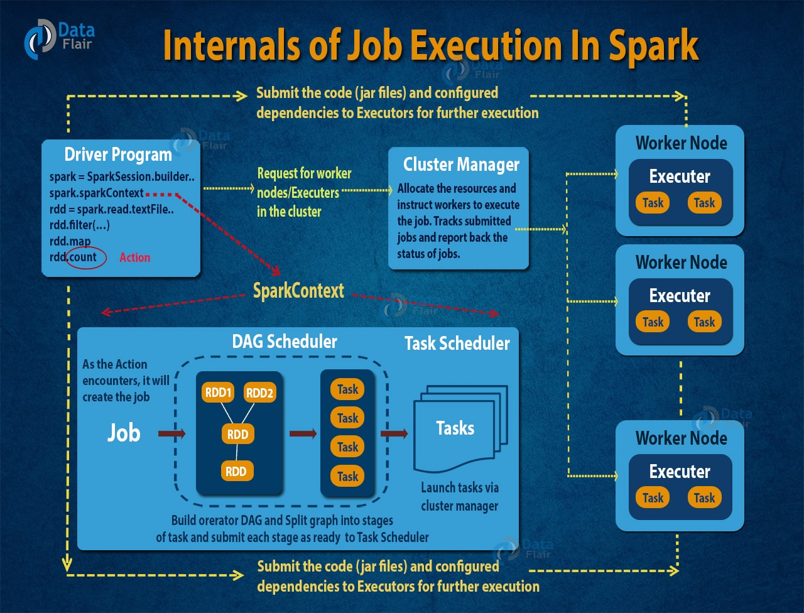
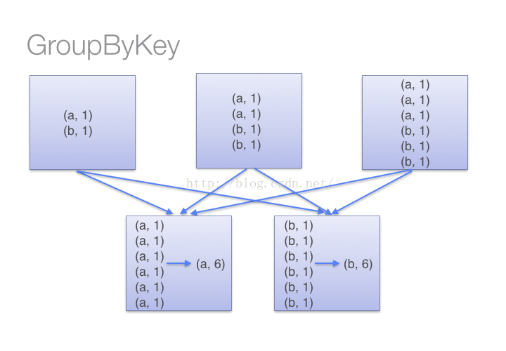
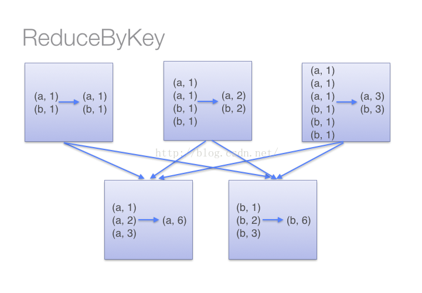

# Spark

基于内存的大数据分析计算引擎。


## 0. 框架



（3）Spark SQL
Spark SQL提供在大数据上的SQL查询功能。有一些**查询解析和优化**

（4）Spark Streaming
Spark Streaming 提供了用来操作数据流的API，并且和RDD API高度对应. 

原理：Spark Streaming是将流式计算分解成一系列短小的批处理作业。批处理引擎Spark Core把Spark Streaming的输入数据按照batch size（如1秒）分成一段一段的数据（Discretized Stream），每一段数据都转换成Spark中的RDD，然后将Spark Streaming中对DStream的Transformation操作变为针对Spark中对RDD的Transformation操作，将RDD经过操作变成中间结果保存在内存中。整个流式计算根据业务的需求可以对中间的结果进行叠加或者存储到外部设备。
(Spark Streaming通过将流数据按指定时间片累积为RDD，然后将每个RDD进行批处理，进而实现大规模的流数据处理。
)

### Spark 大致运行机理




- 解释器是第一层。Spark 通过使用Scala解释器，来解释代码，并会对代码做一些修改。
- 在Spark控制台中输入代码时，Spark会创建一个 operator graph， 来记录各个操作。
- 当一个 RDD 的 Action 动作被调用时， Spark 就会把这个 operator graph 提交到 DAG scheduler 上。
- DAG Scheduler 会把 operator graph 分为各个 stage。 一个 stage 包含基于输入数据分区的task。DAG scheduler 会把各个操作连接在一起。
- 这些 Stage 将传递给 Task Scheduler。Task Scheduler 通过 cluster manager 启动任务。Stage 任务的依赖关系， task scheduler 是不知道的。
- 在 slave 机器上的 Worker 们执行 task。


## 1. 一些关键名词解释：

### a. transformation: 

transformation算子是根据一个数据源RDD得到一个新的RDD。延迟加载：Transformation算子的代码不会真正被执行。只有当我们的程序里面遇到一个action算子的时候。举例：map, filter, flatmap, groupByKey, reduceByKey... 可以根据RDD 的 transformation 分为两种：窄依赖（如map、filter），宽依赖（如reduceByKey）。 窄依赖不需要对分区数据进行 shuffle ，而宽依赖需要。所以窄依赖都会在一个 stage 中， 而宽依赖会作为 stage 的交界处。

### b. action: 

action算子是得到一个value。触发代码的运行。一段Spark代码里至少要有一个action操作。reduce, count, collect
    
### c. broadcast parameter:

 ### d. RDD:
弹性分布式数据集, 相当于内存中的数据库。

弹性，是指内存不够时可以与磁盘进行交换

### e. Dataframe:
    
### f. DataSet:

### g.master & worker

和**资源**相关的组件。

只有Spark集群的Standalone独立部署环境中，因为**不需要依赖其他的资源调度框架，自身实现资源调度**， 所以这种情况下使用master and worker.

此时：master负责资源调度和分配、集群监控
worker：进程，一个worker运行在一个服务器上，对数据计算。


### h. driver：
    
驱动节点, 和**计算**相关

driver调度和执行应用代码。具体功能：

    1. 用户程序转为job
    2. 将Spark应用代码拆分成多个stage
    3. 为每个stage创建一批tasks。(stage内，最终RDD有多少个partition就有多少个task)
    4. 将tasks分配给各个executor中执行。负责执行executor之间的task调度。
    5. 跟踪executor执行情况。
    6. 通过UI洁面展示查询运行情况。


### i. executor：Worker节点的一个JVM进程。

一个worker可以有多个executor。（RDD是直接缓存在executor进程内的）
任务：
1. 执行任务task
2. 返回任务给Driver
（为了提升任务效率，还使用了缓存的RDD。

因此driver要向master申请资源。申请方式：使用ApplicationMaster申请。

`Driver -> ApplicationMaster -> Master`

### j. executor and core:

executor的资源：core个数和Memory

## 2. 参数与优化

重要参数与普遍优化策略：
```s
-- num-executors: 配置Executor的数量
-- executor-memory: 配置每个Executor的内存大小
-- executor-cores: 配置每个Executor的虚拟CPU core数量


其他的优化策略：
规避join倾斜，大小表join做一些广播变量，避免shuffle。
对数据做一个动态的排序。rdd排序需要拉到一个带有数据结构的排序RDD上。
Spark SQL自动把排序来进行优化了。
```


## 3. 环境

### a. Local

本地IDE, 只有一个executor。
功能： 这个executor又可以充当客户提交任务的client, 又可以充当driver， 还可当作执行task的executor。

### b. Standalone独立部署

master-slave模式（只有独立部署才有master-slave模式）

| --|--|--|
Linux1 | Linux2 | Linux3
Worker | Worker | Worker
Master |        |      

> 可以看到有一个Linux节点又当master又当worker.

执行流程：

1.SparkContext连接到Master，向Master注册并申请资源（CPU Core 和Memory）；
2.Master根据信息给Worker分配资源：
根据SparkContext的资源申请要求和Worker心跳周期内报告的信息决定在哪个Worker上分配资源，然后在该Worker上获取资源，然后启动StandaloneExecutorBackend；
3.StandaloneExecutorBackend向SparkContext注册；
4.SparkContext将Applicaiton代码发送给StandaloneExecutorBackend；并且SparkContext解析Applicaiton代码，构建DAG图，并提交给DAG Scheduler分解成Stage（当碰到Action操作时，就会催生Job；每个Job中含有1个或多个Stage，Stage一般在获取外部数据和shuffle之前产生），DAG Scheduler将TaskSet提交给Task Scheduler，Task Scheduler负责将Task分配到相应的Worker，最后提交给StandaloneExecutorBackend执行；
5.StandaloneExecutorBackend建立Executor线程池，开始执行Task，并向SparkContext报告，直至Task完成。
6.所有Task完成后，SparkContext向Master注销，释放资源。


#### HA高可用：
由于会发生单节点故障问题，一个master容易break down, 因此可以配置多个master，一个发生了故障另一个继续进行。

其中一个master Alive状态的时候，另一个是standby状态，不执行。

### c. Yarn

Standalone模式是由**Spark自身提供计算资源**，独立性强，固定的资源分配策略。每个任务固定数量的core，各个Job按顺序依次分配。适合单用户情况。

Yarn支持动态资源配置。因为Spark本身的资源调度能力是有限的，可以通过Yarn使用其他调动系统
运行在Yarn的框架都共享一个集中配置好的资源池，可以利用Yarn资源调度来分类，隔离以及负载均衡。
使用Yarn，Spark可以运行在k8s hadoop之上。 


（资源的申请和分配）


### d. K8s, Mesos

Mesos是Apache下的开源分布式资源管理框架，国内用的不多。
K8s是容器式的部署方式。基于Docker镜像可以让用户更加方便的管理。


TimeStamp By

### 部署模式总结：
1. Local: Spark安安装机器数量：1， 不需启动进程， 所属：Spark. 场景： 测试
2. Standalone: Spark安装机器数量：3(资源，机器要自己准备)， master+worker, 所属：Spark 场景：单独部署
3. Yarn模式：Spark安装机器数量：1， 需要启动进程：Yarn+HDFS， 所属：Hadoop（因为yarn属于Hadoop）， 场景：混合部署（混合了yarn和spark）


## 4. Shuffle


上游一个分区中的数据被下游多个分区的数据所共享：宽依赖-> 发生shuffle

需要等待所有partition中的数据全部执行完毕之后再运行。因此partition之间需要等待直到所有partition都处理完毕。

因此这里partition中的数据需要等待->放到磁盘中进行等待。

> Shuffle一定会要落盘：因此速度很慢。


### Shuffle **提高速度的方法**：

1. 使落盘的数据量变少-> reduce by key, group by key. 算子如果存在**预聚合功能**，就能提高性能

2. 一些改进：

小文件变多，性能下降（早期hashShuffle）


这样在core比较多的时候，操作文件数量依然很多 (优化后的hashShuffle)


把文件分段，一个task读取一个file的其中一段。另外还需要加上一个索引index文件。（SortShuffle）

先通过sort让文件依次按照一定的顺序分段放在整个大文件中，这样index时候有规律就快。
但是sort很慢，所以可以将sort改成hash，不需要排序也能快速定位。


**现在的shuffle的过程**


## 5. 内存管理

### 内存分布: OnHeap + OffHeap

1） OnHeap:
基于JVM堆内空间的分配，在此基础上做了更详细的分配，来充分利用内存。`参数：--executor-memory` 
Executor内运行的并发任务共享JVM堆内外存。

2）OffHeap:
JVM还有OffHeap内存，（worker节点的系统内存中开辟空间，从而优化内存）

为了提高Shuffle排序的效率，存储优化过的二进制数据。

默认只使用来堆内内存。
### 内存区域划分

1. Execution内存

2. Storage内存


## 6. 重要参数

提交任务时候的参数：

executor-cores：每个executor的内核数: 4

num-executors: 默认为2

executor-memory: 16G

driver-cores driver使用内核数，默认是1

driver-memory: dirver内存大小，默认512M

Spark运行加购：

Spark弹性内存。动态内存管理。


## 7. Spark架构和作业提交流程

## 8. Spark高容错性和高可伸缩性

## 9. DAG


DAG schedule, test schedule, schedule backend

DAG 是一组顶点和边的组合。顶点代表了 RDD，边代表了对 RDD 的一系列操作。（shuffle为边界划分stage）
DAG Scheduler 会根据 RDD 的 transformation 动作，将 DAG 分为不同的 stage，每个 stage 中分为多个 task，这些 task 可以并行运行。
task是分发给了executor来执行的


解决的问题：
Hadoop: 中间输出的结果都要持久化到硬盘上或者HDFS；每个Map Recude都是互相独立的，Hadoop不知道会有那些Map Recude.

因此：1 浪费存储资源：在某些迭代的场景下，MapReduce 框架会对硬盘和 HDFS 的读写造成大量浪费。2 复杂计算占用时间：所以当我们处理复杂计算时，会需要很长时间，但是数据量却不大

Spark怎么解决的：
Spark 中引入了 DAG，它可以优化计算计划，比如减少 shuffle 数据。

> 源码可以从Spark context里看

# 产品对比

## 1）和flink的区别

## 2）Spark相比Hadoop MapReduce的优势

（1） 中间结果的处理

Hadoop在MapReduce时候，中间产生多个stage，每个stage有一些中间数据，需要使用HDFS来存储Stage的输出结果。**但是Spark将执行模型抽象为通用的有向无环图执行计划（DAG）** （抽象成这样又怎样

（2）数据格式和内存布局
Spark抽象出分布式内存存储结构弹性分布式数据集RDD,进行数据的存储。

（3）执行策略
Spark任务在shuffle中不是所有情景都需要排序,所以支持基于Hash的分布式聚合,调度中采用更为通用的任务执行计划图(DAG),每一轮次的输出结果在内存缓存


## 3）


# RDD

RDD 编程模型，弹性分布式的数据集合。（是个数据结构）
弹性：可以伸缩，partition 聚合partition，
一个RDD的数据可能存放在多个节点上。

Hadoop每次只用制定一个HDFS路径，可以迎合成多个副本。

（后面怎么执行和分布


## action、transformation

transformation：对数据的一些修饰: map, reduce by, sum等，对数据进行各种修饰，都是transformation的过程

具体的一个计算：就是一个action，提交一个job。

- shuffle就会生成一个stage
- action会生成一个job

## 常用的算子

Map, flatMap, reduceBy, groupby。后两个的区别。

## RDD宽窄依赖

shuffle的过程 -> 上游RDD向下游传递数据，对应的partition个数不一样。partition来源也不一样。

RDD.map之后，类发生了变化。

主要是RDD之间的转换。

和stage的划分相关联。

## RDD 广播变量

广播，两个数据join时，把两个数据从两个节点中放到一起，小表和大表join。小表的数据全部分发到大表数据中的每个节点，就可以就地join，减少shuffle的量。 不然就需要让这两个节点都放到一个node上，数据迁移的时间很长。

## RDD 缓存级别

Memory内存
disk缓存
persist，可以看看源码的注解


**RDD生成有两种方式：paralize, 读取外部文件变成RDD。**

## RDD使用层面上的

适当的做一些数据做缓存。有几个任务，几个任务结果之间有关联性，就可以做一个缓存，读起来更方便，不会丢失数据。

RDD计算过程中，数据集算top的时候，选择自带排序结构。

配置上的优化：

    spark SQL是spark core的封装，都转换成了RDD来执行的。

    spark SQL有一定的了解：基本不用RDD了：1）应用场景：大数据很多时候是大数据分析，使用SQL就可以了。2）Spark SQL有很多优化，包装在了SQL中的执行过程中。


>groupByKey, reduceByKey区别是啥？

针对pair RDD时候：

groupByKey:


reduceByKey:



# Reference

https://data-flair.training/blogs/dag-in-apache-spark/

https://waltyou.github.io/Spark-DAG/

https://juejin.cn/post/6844903959254024206