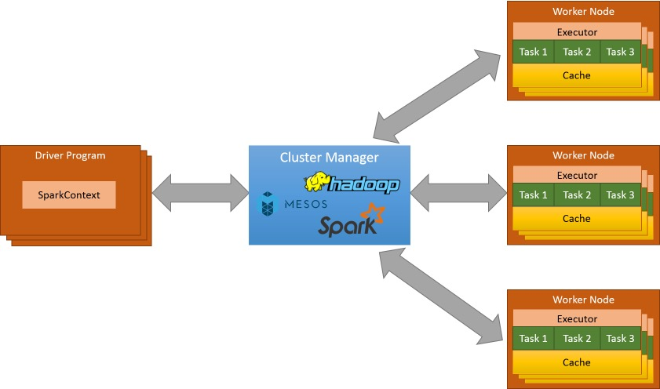
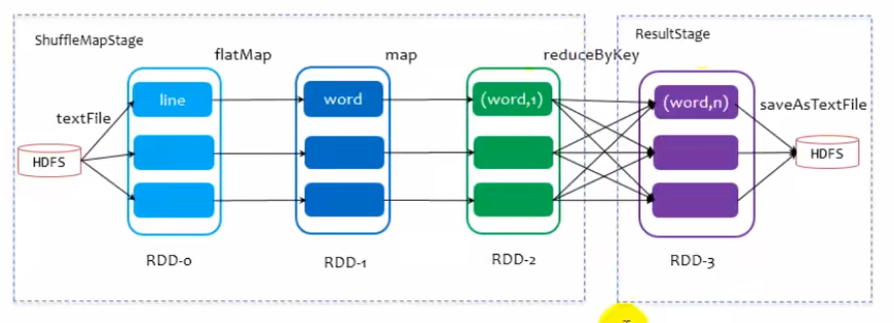
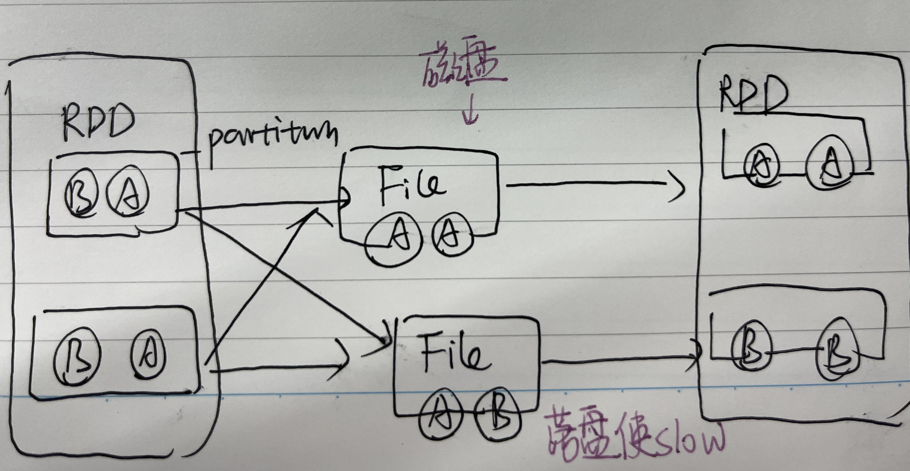
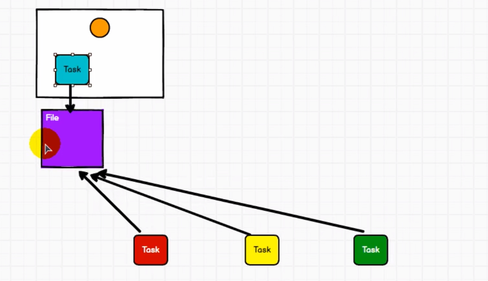
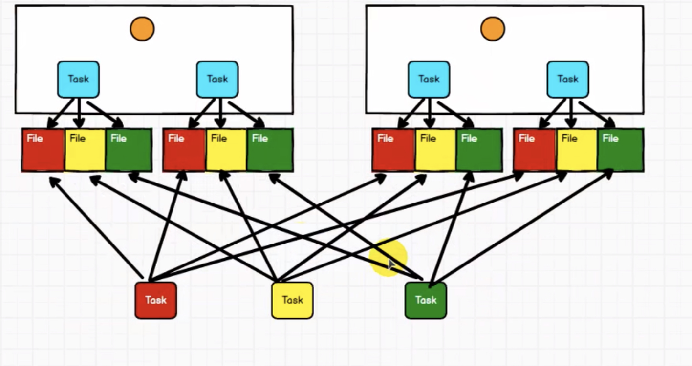
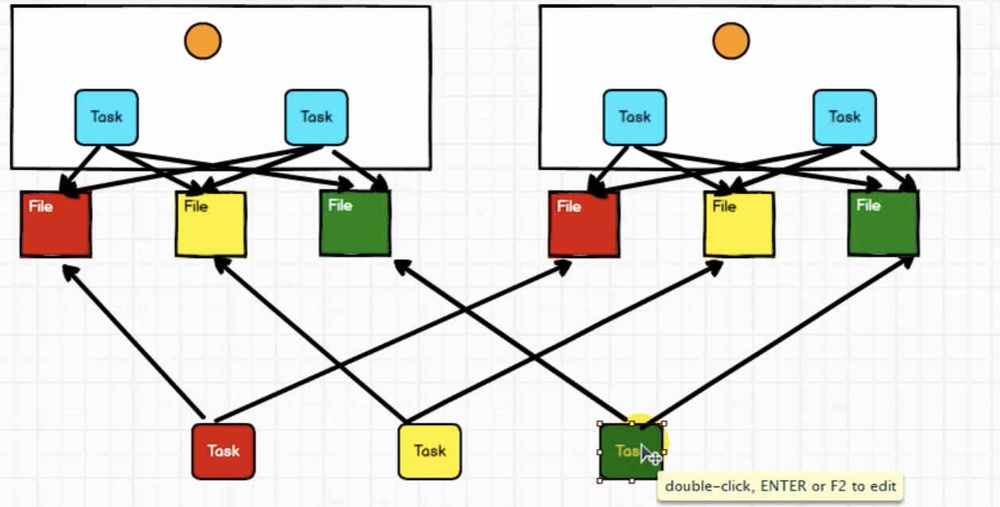
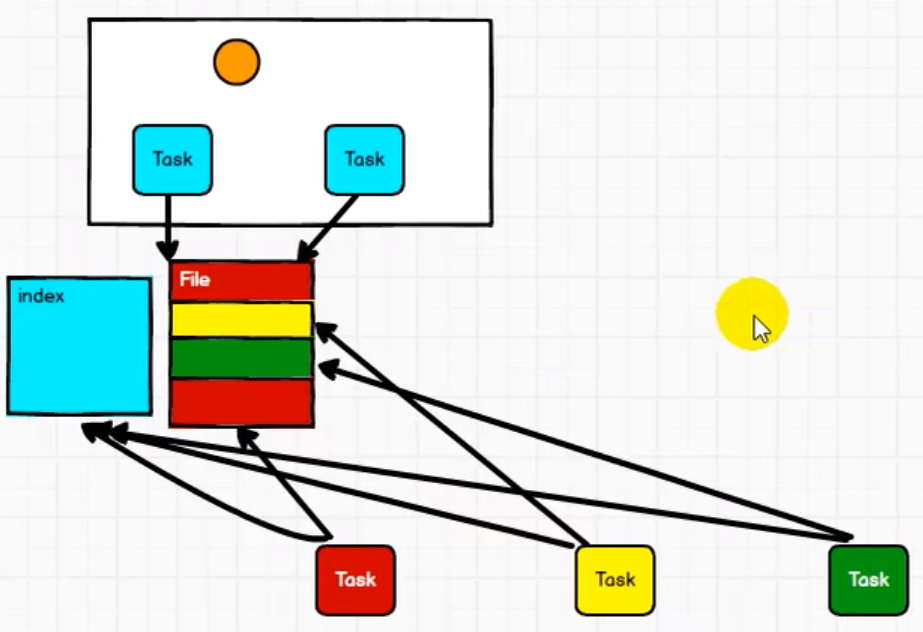

# Spark

基于内存的大数据分析计算引擎。

内存：
## 0. 框架

（3）Spark SQL
Spark SQL提供在大数据上的SQL查询功能。有一些**查询解析和优化**

（4）Spark Streaming
Spark Streaming通过将流数据按指定时间片累积为RDD，然后将每个RDD进行批处理，进而实现大规模的流数据处理。


## 1. executor、driver; master、workder的区别

#### master & worker

和**资源**相关的组件。

只有Spark集群的Standalone独立部署环境中，因为**不需要依赖其他的资源调度框架，自身实现资源调度**， 所以这种情况下使用master and worker.

此时：master负责资源调度和分配、集群监控
worker：进程，一个worker运行在一个服务器上，对数据计算。


driver和executor进程

driver可以运行在master上，也可以运行worker上。
driver首先会向集群管理者（standalone、yarn，mesos）申请spark应用所需的资源，也就是executor。集群管理者在各个worker上分配一定数量的executor，每个executor都占用一定数量的cpu和memory。


#### driver：驱动节点，执行Spark任务中的main方法。实际代码的执行工作。


和**计算**相关的组件。

driver调度和执行应用代码。具体功能：
1. 用户程序转为job
2. 将Spark应用代码拆分成多个stage
3. 为每个stage创建一批tasks。(stage内，最终RDD有多少个partition就有多少个task)
4. 将tasks分配给各个executor中执行。负责执行executor之间的task调度。
5. 跟踪executor执行情况。
6. 通过UI洁面展示查询运行情况。


> difference between job and task:


#### executor：Worker节点的一个JVM进程。
一个worker可以有多个executor。每个executor有一个线程池。（RDD 是直接缓存在executor进程内的）
任务：
1. 执行任务task
2. 返回任务给Driver
（为了提升任务效率，还使用了缓存的RDD。

因此driver要向master申请资源。申请方式：使用ApplicationMaster申请。

`Driver -> ApplicationMaster -> Master`

## 2. executor and core:

executor的资源：core个数和Memory

重要参数：
```s
-- num-executors: 配置Executor的数量
-- executor-memory: 配置每个Executor的内存大小
-- executor-cores: 配置每个Executor的虚拟CPU core数量
```


## 3. 环境

### a. Local

本地IDE, 只有一个executor。
功能： 这个executor又可以充当客户提交任务的client, 又可以充当driver， 还可当作执行task的executor。

### b. Standalone独立部署

master-slave模式（只有独立部署才有master-slave模式）

| --|--|--|
Linux1 | Linux2 | Linux3
Worker | Worker | Worker
Master |        |      

> 可以看到有一个Linux节点又当master又当worker.

执行流程：

1.SparkContext连接到Master，向Master注册并申请资源（CPU Core 和Memory）；
2.Master根据信息给Worker分配资源：
根据SparkContext的资源申请要求和Worker心跳周期内报告的信息决定在哪个Worker上分配资源，然后在该Worker上获取资源，然后启动StandaloneExecutorBackend；
3.StandaloneExecutorBackend向SparkContext注册；
4.SparkContext将Applicaiton代码发送给StandaloneExecutorBackend；并且SparkContext解析Applicaiton代码，构建DAG图，并提交给DAG Scheduler分解成Stage（当碰到Action操作时，就会催生Job；每个Job中含有1个或多个Stage，Stage一般在获取外部数据和shuffle之前产生），DAG Scheduler将TaskSet提交给Task Scheduler，Task Scheduler负责将Task分配到相应的Worker，最后提交给StandaloneExecutorBackend执行；
5.StandaloneExecutorBackend建立Executor线程池，开始执行Task，并向SparkContext报告，直至Task完成。
6.所有Task完成后，SparkContext向Master注销，释放资源。


#### HA高可用：
由于会发生单节点故障问题，一个master容易break down, 因此可以配置多个master，一个发生了故障另一个继续进行。

其中一个master Alive状态的时候，另一个是standby状态，不执行。

### c. Yarn

Standalone模式是由**Spark自身提供计算资源**，独立性强，固定的资源分配策略。每个任务固定数量的core，各个Job按顺序依次分配。适合单用户情况。

Yarn支持动态资源配置。因为Spark本身的资源调度能力是有限的，可以通过Yarn使用其他调动系统
运行在Yarn的框架都共享一个集中配置好的资源池，可以利用Yarn资源调度来分类，隔离以及负载均衡。
使用Yarn，Spark可以运行在k8s hadoop之上。 




### d. K8s, Mesos

Mesos是Apache下的开源分布式资源管理框架，国内用的不多。
K8s是容器式的部署方式。基于Docker镜像可以让用户更加方便的管理。


TimeStamp By

### 部署模式总结：
1. Local: Spark安安装机器数量：1， 不需启动进程， 所属：Spark. 场景： 测试
2. Standalone: Spark安装机器数量：3(资源，机器要自己准备)， master+worker, 所属：Spark 场景：单独部署
3. Yarn模式：Spark安装机器数量：1， 需要启动进程：Yarn+HDFS， 所属：Hadoop（因为yarn属于Hadoop）， 场景：混合部署（混合了yarn和spark）


## 4. Shuffle



上游一个分区中的数据被下游多个分区的数据所共享：宽依赖-> 发生shuffle

需要等待所有partition中的数据全部执行完毕之后再运行。因此partition之间需要等待直到所有partition都处理完毕。

因此这里partition中的数据需要等待->放到磁盘中进行等待。

> Shuffle一定会要落盘：因此速度很慢。



### Shuffle **提高速度的方法**：

1. 使落盘的数据量变少-> reduce by key, group by key. 算子如果存在**预聚合功能**，就能提高性能

2. 一些改进：

多个task一起读容易产生数据量混乱的问题


小文件变多，性能下降（早期hashShuffle）


这样在core比较多的时候，操作文件数量依然很多 (优化后的hashShuffle)


把文件分段，一个task读取一个file的其中一段。另外还需要加上一个索引index文件。（SortShuffle）

先通过sort让文件依次按照一定的顺序分段放在整个大文件中，这样index时候有规律就快。
但是sort很慢，所以可以将sort改成hash，不需要排序也能快速定位。



## 5. 内存管理

### 内存分布: OnHeap + OffHeap

1） OnHeap:
基于JVM堆内空间的分配，在此基础上做了更详细的分配，来充分利用内存。`参数：--executor-memory` 
Executor内运行的并发任务共享JVM堆内外存。

2）OffHeap:
JVM还有OffHeap内存，（worker节点的系统内存中开辟空间，从而优化内存）

为了提高Shuffle排序的效率，存储优化过的二进制数据。

默认只使用来堆内内存。
### 内存区域划分

1. Execution内存

2. Storage内存


## 6. 重要参数

提交任务时候的参数：

executor-cores：每个executor的内核数: 4
num-executors: 默认为2
executor-memory: 16G
driver-cores driver使用内核数，默认是1
driver-memory: dirver内存大小，默认512M

Spark运行加购：


## 7. Spark架构和作业提交流程

## 8. Spark高容错性和高可伸缩性

# 产品对比

## 1）和flink的区别

## 2）Spark相比Hadoop MapReduce的优势

（1） 中间结果的处理

Hadoop在MapReduce时候，中间产生多个stage，每个stage有一些中间数据，需要使用HDFS来存储Stage的输出结果。**但是Spark将执行模型抽象为通用的有向无环图执行计划（DAG）** （抽象成这样又怎样

（2）数据格式和内存布局
Spark抽象出分布式内存存储结构弹性分布式数据集RDD,进行数据的存储。

（3）执行策略
Spark任务在shuffle中不是所有情景都需要排序,所以支持基于Hash的分布式聚合,调度中采用更为通用的任务执行计划图(DAG),每一轮次的输出结果在内存缓存


## 3）