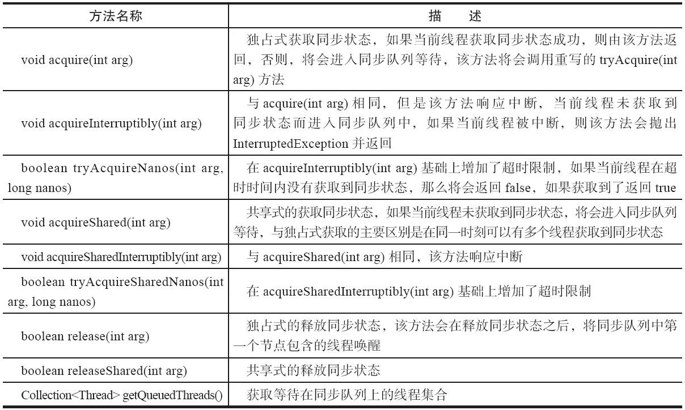

# AQS 队列同步器

构建锁和同步器的框架。可以提供给mutex, retrantLock等使用

## 作用

定义了很多同步state的获取和释放的方法来提供同步组件使用，一般用来被继承。提供了一些方法例如`getState`, `setState` `compareAndSetState`

支持共享Share和独占两种方式。

提供了一些需要被重写的方法，然后就可以将同步器组合在自定义的同步组建中实现了。重写的方法有

- `tryActuire` : 独占获取同步状态，判断是否符合预期，
- `tryRelease`：独占获取释放状态，

### 模版提供的方法分类

1. 独占获得和释放同步状态

2. 共享获得和释放同步状态

3. 查询同步队列中的等待线程的情况。

提供的模版方法：


## 结构分析
AbstractQueuedSynchronizer （以后简称AQS）是一个抽象类，定义了一些通用功能以及子类需要根据自身特性重写实现的方法，有两个内部类 Node和ConditionObject, 以及2个链表结构的队列，

- Sync queue，即同步队列，是双向链表，包括head结点和tail结点，head结点主要用作后续的调度。存储尝试获取锁，未获取到等待的线程

- Condition queue不是必须的，单向链表，只有当使用Condition时，才会存在此单向链表。并且可能会有多个Condition queue。**用来存放某些线程已经获取到锁了**，为了等待某些事件（如IO事件,mq消息等）**主动放弃锁挂起等待条件*的线程。


因此，同步队列是等待获取锁的，condition queue中的线程等待的是条件，它主动调用await方法，主动释放锁后，被放入条件队列中的。

### CLH（Sync queue）

> CLH: 虚拟的双向队列。仅存在节点之间的关联关系。AQS将每条请求共享的资源线程封装成一个CLH锁队列的节点。


### CLH中的Node

内部Node代表一个节点，节点的状态实现方法：volatile+CAS 
```java
static final class Node {
    /** Marker to indicate a node is waiting in shared mode */
    static final Node SHARED = new Node();
    /** Marker to indicate a node is waiting in exclusive mode */
    static final Node EXCLUSIVE = null;
    /** waitStatus value to indicate thread has cancelled */
    static final int CANCELLED =  1;
    /** waitStatus value to indicate successor's thread needs unparking */
    static final int SIGNAL    = -1;
    /** waitStatus value to indicate thread is waiting on condition */
    static final int CONDITION = -2;
    /**
        * waitStatus value to indicate the next acquireShared should
        * unconditionally propagate
        */
    static final int PROPAGATE = -3;

    private transient volatile Node head;

    private transient volatile Node tail;

    /**
    CANCELLED，值为1，表示当前的线程被取消。被中断后，不再需要再在队列中等待资源了，需要执行节点出队操作
    SIGNAL，值为-1，表示当前节点的后继节点包含的线程需要运行，需要被unpark
    CONDITION，值为-2，表示当前节点在等待condition，在condition队列中
    PROPAGATE，值为-3，表示当前场景下后续的acquireShared能够得以执行
    默认值为0，表示当前节点在sync队列中，等待着获取锁。
    */
    volatile int waitStatus;
    
    // 前驱结点
    volatile Node prev;    
    // 后继结点
    volatile Node next;        
    // 结点所对应的线程引用
    volatile Thread thread;        
    // 下一个等待者
    Node nextWaiter;
    ...

    // 结点是否在共享模式下等待
    final boolean isShared() {
        return nextWaiter == SHARED;
    }
}


/** 整个类的共享变量，表示同步状态， 内部使用CAS对这个值进行更改 */
    private volatile int state;
/**
* 对状态的修改：
*/
protected final boolean compareAndSetState(int expect, int update) {
    // See below for intrinsics setup to support this
    return unsafe.compareAndSwapInt(this, stateOffset, expect, update);
}

```

### state的状态

其中state有以下几个类型：

1. SIGNAL
> SIGNAL: blocked (via park), so the current node must unpark its successor后继 when it releases or cancels. To avoid races, acquire methods must first indicate they need a signal, then retry the atomic acquire, and then, on failure, block. 当前节点线程在使用完同步资源，释放资源后，需要去唤醒后面的一个节点中的线程

2. CANCELLED
> This node is cancelled due to timeout or interrupt. a thread with cancelled node never again blocks. 需要从队列中移除

3. CONDITION

### ObjectCondition类（condition队列）
继承了Condition接口的一些方法

定义了等待和通知的方法。因为里面的线程是因为触发某些原因中断而自发的调用await从而释放锁的。

condition是依赖当前的锁。

await(): 是当前进程加入等待Condition队列，并释放锁
signal(): 唤醒队列中等待时间最长的节点，唤醒前将节点移动到同步队列。

```java
// Condition中的一些接口

public interface Condition {

    // 等待，当前线程在接到信号或被中断之前一直处于等待状态
    void await() throws InterruptedException;
    
    // 等待，当前线程在接到信号之前一直处于等待状态，不响应中断
    void awaitUninterruptibly();
    
    //等待，当前线程在接到信号、被中断或到达指定等待时间之前一直处于等待状态 
    long awaitNanos(long nanosTimeout) throws InterruptedException;
    
    // 等待，当前线程在接到信号、被中断或到达指定等待时间之前一直处于等待状态。此方法在行为上等效于: awaitNanos(unit.toNanos(time)) > 0
    boolean await(long time, TimeUnit unit) throws InterruptedException;
    
    // 等待，当前线程在接到信号、被中断或到达指定最后期限之前一直处于等待状态
    boolean awaitUntil(Date deadline) throws InterruptedException;
    
    // 唤醒一个等待线程。如果所有的线程都在等待此条件，则选择其中的一个唤醒。在从 await 返回之前，该线程必须重新获取锁。
    void signal();
    
    // 唤醒所有等待线程。如果所有的线程都在等待此条件，则唤醒所有线程。在从 await 返回之前，每个线程都必须重新获取锁。
    void signalAll();
}
```

#### 阻塞（await）方法概览:
```java
...
while (!isOnSyncQueue(node)) {
    LockSupport.park(this);
    if ((interruptMode = checkInterruptWhileWaiting(node)) != 0)
        break;
}
...
```
#### 唤醒：

```java
// 唤醒first这个进程
public final void signal() {
    if (!isHeldExclusively())
        throw new IllegalMonitorStateException();
    Node first = firstWaiter;
    if (first != null)
        doSignal(first);
}

private void doSignal(Node first) {
    do {
        if ( (firstWaiter = first.nextWaiter) == null)
            lastWaiter = null;
        first.nextWaiter = null;
    } while (!transferForSignal(first) && // // 将结点从condition队列转移到sync队列失败并且condition队列中的头结点不为空，一直循环  
        (first = firstWaiter) != null);
}

// 修改status，失败则返回。但是doSignal会循环持续调用直到修改成功
final boolean transferForSignal(Node node) {
    /*
        * If cannot change waitStatus, the node has been cancelled.
        */
    if (!compareAndSetWaitStatus(node, Node.CONDITION, 0))
        return false;

    /*
        * Splice onto queue and try to set waitStatus of predecessor to
        * indicate that thread is (probably) waiting. If cancelled or
        * attempt to set waitStatus fails, wake up to resync (in which
        * case the waitStatus can be transiently and harmlessly wrong).
        */
    Node p = enq(node);
    int ws = p.waitStatus;
    if (ws > 0 || !compareAndSetWaitStatus(p, ws, Node.SIGNAL))
        LockSupport.unpark(node.thread);
    return true;
}

```


### acquire（针对独占式资源）

```java
public final void acquire(int arg) {
    if (!tryAcquire(arg) && acquireQueued(addWaiter(Node.EXCLUSIVE), arg))
        selfInterrupt();
}
```
该方法以独占模式获取(资源)，忽略中断，即线程在aquire过程中，中断此线程是无效的

- 首先调用`tryAcquire`, 试图在独占模式下获取对象状态，实现方法由子类决定(例如ReentrantLock就有公平方式和非公平两种方式)

- 如果无法获得，则使用`addWaiter`方法将这个线程封装成Node添加在sync queue尾部添加结点。轮训方式添加到队列末尾直到成功。

- 调用`acquireQueued`方法，返回线程是否被中断。如果上一步添加node后发现它的前置节点是head, 就再次尝试一次获取锁资源，如果已经被释放了，那(线程)就去获取锁执行。如果不是头节点或者尝试获取锁资源失败，那就在队列找个位置挂起等待了 。此时需要找一个安全点，确保前面的有效节点（没被取消的节点）的线程执行后，能够通知唤醒自己，当前节点线程才安心挂起等待。并且将前置节点state设置为SIGNAL.

```java
final boolean acquireQueued(final Node node, int arg) {
    //默认是失败
    boolean failed = true;
    try {
        //默认是没有被中断
        boolean interrupted = false;
        //无限循环
        for (;;) {
            final Node p = node.predecessor();
            //1，如果前置节点是head节点，再去尝试获取锁，如果获取成功了，则将自己更新为head，此时当前线程可以执行了。
            if (p == head && tryAcquire(arg)) {
                setHead(node);
                p.next = null; // help GC
                failed = false;
                // 此时返回 false，没被中断
                return interrupted;
            }
            //2,1失败或前置不是head,那么要定位一个有效的位置去阻塞等待，前面有些节点可能是被取消的，需要跳过这些节点，清除出队列，shouldParkAfterFailedAcquire就是来做这个事
            if (shouldParkAfterFailedAcquire(p, node) && parkAndCheckInterrupt())
                //3,标记中断标记，返回被中断过 
                interrupted = true;
        }
    } finally {
        // 4,正常情况下是一直会进行for循环，当跳出该循环，即出现异常，如被标记了中断，去调用阻塞，抛出中断异常,此时没有在队列中找到安全位置，因此将该节点移出队列
        if (failed)
            cancelAcquire(node);
    }
}
```

### Release

```java

public final boolean release(int arg) {
    if (tryRelease(arg)) { // 释放成功
        // 保存头结点
        Node h = head; 
        if (h != null && h.waitStatus != 0) // 头结点不为空并且头结点状态不为0
            unparkSuccessor(h); //释放头结点的后继结点
        return true;
    }
    return false;
}

```

tryRelease需要子类具体去实现。

## Reference
1 juc源码

2 [参考博文1](https://www.pdai.tech/md/java/thread/java-thread-x-lock-AbstractQueuedSynchronizer.html)
 
3 [参考博文2](https://bbs.huaweicloud.com/blogs/detail/140215)

4 java并发编程的艺术
