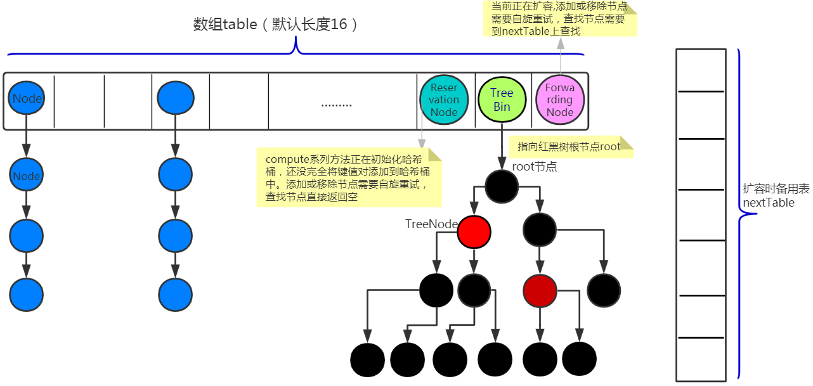

# 实现概览

jdk1.7之前的使用分段锁segment，每个segment内部是一个hashTable。jdk1.8用数组+链表+红黑树+CAS原子操作 实现 ConcurrentHashMap，也就是给么给线程分配一个桶的区间，并发扩容于转移。

# HashTable
HashTable: synchronized对**整个**对象进行put等修改Hash时，进行加锁

# jdk1.7的策略

在对象中保存了一个Segment数组，将整个Hash表划分成多个分段。每个Segment类似于一个HashTable。

每个Segment通过继承ReentrantLock进行加锁。所以每次锁住的是一个segment。segment数组无法扩容。

## 参数

- concurrencyLevel: 并行级别、并发数、Segment的个数。默认为16.

- initialCapacity：初始容量。整个ConcurrentHashMap的初始容量，实际操作需要平均分给每个Segment

-LoadFactor: 负载因子，默认0.75，给每个segment内部用的。Segment数组无法扩容，但是内部可以扩容。

## 初始化槽ensureSegment

> 并发操作使用CAS进行控制。

ConcurrentHashMap初始化会初始化第一个Segment[0], 对于其他槽，是在插入第一个槽的时候进行的初始化。
因为初始化其他槽的时候，需要用当前的segment[0]处的数组长度和负载因子进行初始化。

但是初始化某个槽segment[k]就涉及到多线程对他初始化。

    首先检查这个segment是否被其他线程初始化了。如果没有，就设置一个while循环，while（没被初始化UNSAFE.getObjectVolatile，就循环内部CAS对segment赋值），直到当前线程成功设置or其他线程成功设置。


## 插入set
初始化得到一个Segment数组`Segment<K, V>s`。Segment[i]默认大小为2

插入节点到表头。

1. hash（key）得到数组中的位置j: hash是32位，又因为concurrencyLevel=16，有16个segment, 因此高4位代表的数组下标。
2. segment内部插入。segment内部是数组+链表。现获取segment独占锁。

> 并发：首先获取内部锁，是利用node=tryLock(), 如果获得成功，就利用scanAndLockForPut循环tryLock获得锁。失败次数超过阈值，就进入lock()阻塞队列等待。

## get

没有加锁

问题：get的时候发生remove or put可能有问题。但是：添加节点是通过加到表头实现的。如果这个时候get操作在链表的遍历中已经到了中间，就不会影响。

volatile关键字可以保证put的时候的可见性。

## 限制

最大的并发度受Segment的个数限制。

# JDK1.8

精髓：通过给每个线程分配一个桶的区间，进行并发式的扩容。

1.8没有用到分段锁segment。加锁使用**CAS+Synchronized实现**。 虽然也定义了Segment静态内部类，但JDK1.8中只有在（反）序列化方法中使用了这个类，只是为了（反）序列化时与JDK1.7相兼容而已。

容量大小：2的次幂：扩容的时候要保证是2的次幂。因为计算桶的hash值时，需要与容量-1（全1）想与得到。而不是取余。因此需要让容量-1为全1的数。

但是改革之后，计算hash的方法不是这种，而是用前16位与后16位与得到。


图片来源🔗：https://www.cnblogs.com/gocode/p/analysis-source-code-of-ConcurrentHashMap.html


## 重要常量

```java
private static final int MIN_TRANSFER_STRIDE = 16; //多线程扩容时每个线程处理的最少哈希桶个数

private static final int DEFAULT_CONCURRENCY_LEVEL = 16;//默认并发线程数

static final int MOVED     = -1; // hash for forwarding nodes. 当前节点正在扩容、移除或重试。查找需要的nextTable上进行
static final int TREEBIN   = -2; // hash for roots of trees表示这个是红黑树
static final int RESERVED  = -3; // hash for transient reservations,为常量-3。用来保存

// 链表节点Node、红黑树节点TreeNode这两种正常节点的hash属性是非负数变量
```
## 关键数据结构

## 关键变量
```java

1. sizeCtl

    当大于>0时，在initTable中可以用来初始化table容量,初始化之后，表示下次要扩容的阀值。<0,说明有其他进程在对初始化table中。|sizeCtl|=（1 +正在resize的线程数）
    
 /**
     * Table initialization and resizing control.  When negative, the
     * table is being initialized or resized: -1 for initialization,
     * else -(1 + the number of active resizing threads).  Otherwise,
     * when table is null, holds the initial table size to use upon
     * creation, or 0 for default. After initialization, holds the
     * next element count value upon which to resize the table.
     */
    private transient volatile int sizeCtl;

```

## CAS和Synchronized都用在哪里了

CAS:

    1. 修改sizeCtl的时候，使用CAS修改。(sizeCtl可以用来初始化table的大小)

Synchronized:

    1. 锁住桶内部的头节点。（也就是将桶内的链表or红黑树锁住了，进行修改。

volatile：

    1. 整个数组table是volatile的

## put

找到hash值对应的数组下标。如果数组中这个桶为空，则直接CAS方式插入。如果CAS失败，则进入下一个循环。

```
1. 首先初始化table

再根据位运算“(n-1)& hash”取余求出table的索引i，并进一步获取table下标为i的元素f,此f代表一个哈希桶，它一个单向链表或红黑树。

2. 若桶是否是空的，里面链表头指针是null，直接CAS自旋进行初始化，初始化成功才可以退出循环.
3. 若f的hash是-1，`(fh = f.hash) == MOVED`则表明table正在resize,要调用helpTransfer加速扩容。helpTransfer方法结束后，自旋重试添加键值对 
4. 若f不为空且其hash也不是-1时,就使用阻塞锁（synchronized关键字）将对象f锁住，再遍历链表f，查找此链表上是否存在Key对应的节点e
5. 若f的数据结构是ReservationNode（说明正在执行comput方法）等其他类型节点就同样需要自旋重试，直到状态恢复正常。
6. 若是正常节点：
    - 判断头指针的hash值是否>0, 是否是链表`(fh = f.hash) >= 0`头节点hash值>0, 所以是链表。若插入后链表长度超过阈值，变成红黑树。
    - 是否是红黑树`f instanceof TreeBin`

```


```java
/** Implementation for put and putIfAbsent */
final V putVal(K key, V value, boolean onlyIfAbsent) {
    if (key == null || value == null) throw new NullPointerException();
    int hash = spread(key.hashCode());
    // 数组长度
    int binCount = 0;
    for (Node<K,V>[] tab = table;;) {
        Node<K,V> f; int n, i, fh;
        // 数组为空，初始化
        if (tab == null || (n = tab.length) == 0)
            tab = initTable();
        // 找hash值对应的桶的下标，如果这个桶是空的，就直接CAS插入
        else if ((f = tabAt(tab, i = (n - 1) & hash)) == null) {
            if (casTabAt(tab, i, null,
                            new Node<K,V>(hash, key, value, null)))
                break;                   // no lock when adding to empty bin
        }
        // 如果桶在的链表的hash值是moved，正在扩容
        else if ((fh = f.hash) == MOVED)
            // 帮助数据迁移，使用多线程的方式，迁移tab这一个桶的数据
            tab = helpTransfer(tab, f);
        // f是头节点, 并且没有进行数据迁移
        else {
            V oldVal = null;
            // 锁住该位置头节点
            synchronized (f) {
                if (tabAt(tab, i) == f) {
                    if (fh >= 0) { // 头节点hash值>0, 所以是链表
                        // 用于累加，记录链表的长度
                        binCount = 1;
                        for (Node<K,V> e = f;; ++binCount) {
                            K ek;
                            if (e.hash == hash &&
                                ((ek = e.key) == key ||
                                    (ek != null && key.equals(ek)))) {
                                oldVal = e.val;
                                if (!onlyIfAbsent)
                                    e.val = value;
                                break;
                            }
                            Node<K,V> pred = e;
                            if ((e = e.next) == null) {
                                pred.next = new Node<K,V>(hash, key,
                                                            value, null);
                                break;
                            }
                        }
                    }
                    else if (f instanceof TreeBin) { // 红黑树
                        Node<K,V> p;
                        binCount = 2;
                        // 调用红黑树的插值方法插入新节点
                        if ((p = ((TreeBin<K,V>)f).putTreeVal(hash, key,
                                                        value)) != null) {
                            oldVal = p.val;
                            if (!onlyIfAbsent)
                                p.val = value;
                        }
                    }
                }
            }
            if (binCount != 0) {
                // 判断是否将链表转成红黑树
                if (binCount >= TREEIFY_THRESHOLD)
                    // 链表转红黑树
                    treeifyBin(tab, i); // 如果长度<64, 则数组扩容，否则就转成红黑树
                if (oldVal != null)
                    return oldVal;
                break;
            }
        }
    }
    addCount(1L, binCount);
    return null;
}

```
## 链表转红黑树


```java
// 不一定转红黑树，如果数组长度<64, 则直接进行数组扩容，否则转红黑树
private final void treeifyBin(Node<K,V>[] tab, int index) {
    Node<K,V> b; int n, sc;
    if (tab != null) {
        if ((n = tab.length) < MIN_TREEIFY_CAPACITY)
            tryPresize(n << 1); // 扩容
        else if ((b = tabAt(tab, index)) != null && b.hash >= 0) {
            synchronized (b) { // 锁住桶的头节点
                if (tabAt(tab, index) == b) {
                    // 遍历链表，建立红黑树
                    TreeNode<K,V> hd = null, tl = null;
                    for (Node<K,V> e = b; e != null; e = e.next) {
                        TreeNode<K,V> p =
                            new TreeNode<K,V>(e.hash, e.key, e.val,
                                                null, null);
                        if ((p.prev = tl) == null)
                            hd = p;
                        else
                            tl.next = p;
                        tl = p;
                    }
                    setTabAt(tab, index, new TreeBin<K,V>(hd));
                }
            }
        }
    }
}

```
## 扩容：tryPresize

CAS的方法修改sizeCtl，然后循环执行, 调用多次transfer方法。第一次调用传入transfer的nextTab是null，是因为nextTab在不进行扩容或其他操作的时候是空的，在进行扩容的时候，作为备用数组使用。但是不涉及多线程调用transfer

```java
/**
    * Tries to presize table to accommodate the given number of elements.
    *
    * @param size number of elements (doesn't need to be perfectly accurate)
    */
private final void tryPresize(int size) {
    // c: size 的 1.5 倍，再加 1，再往上取最近的 2 的 n 次方。
    int c = (size >= (MAXIMUM_CAPACITY >>> 1)) ? MAXIMUM_CAPACITY :
        tableSizeFor(size + (size >>> 1) + 1);
    int sc;
    while ((sc = sizeCtl) >= 0) {
        Node<K,V>[] tab = table; int n;
        // 判断是否需要初始化
        if (tab == null || (n = tab.length) == 0) {
            n = (sc > c) ? sc : c;
            if (U.compareAndSwapInt(this, SIZECTL, sc, -1)) {
                try {
                    if (table == tab) {
                        @SuppressWarnings("unchecked")
                        Node<K,V>[] nt = (Node<K,V>[])new Node<?,?>[n];
                        table = nt;
                        sc = n - (n >>> 2);
                    }
                } finally {
                    sizeCtl = sc;
                }
            }
        }
        else if (c <= sc || n >= MAXIMUM_CAPACITY)
            break;
        else if (tab == table) {
            int rs = resizeStamp(n);
            if (sc < 0) {
                Node<K,V>[] nt;
                if ((sc >>> RESIZE_STAMP_SHIFT) != rs || sc == rs + 1 ||
                    sc == rs + MAX_RESIZERS || (nt = nextTable) == null ||
                    transferIndex <= 0)
                    break;
                // 调用transfer
                if (U.compareAndSwapInt(this, SIZECTL, sc, sc + 1))
                    transfer(tab, nt);
            }
            else if (U.compareAndSwapInt(this, SIZECTL, sc,
                                            (rs << RESIZE_STAMP_SHIFT) + 2))
                // 第一次调用transfer
                transfer(tab, null);
        }
    }
}

```

## 迁移数据Transfer

疑问： 一次移动多少的数据，是以index桶为单位吗，stride的作用？


```java
private final void transfer(Node<K,V>[] tab, Node<K,V>[] nextTab) {
    int n = tab.length, stride;

    if ((stride = (NCPU > 1) ? (n >>> 3) / NCPU : n) < MIN_TRANSFER_STRIDE)
        stride = MIN_TRANSFER_STRIDE; // subdivide range 步长
    if (nextTab == null) {            // initiating
        try {
            // 容量翻倍
            @SuppressWarnings("unchecked")
            Node<K,V>[] nt = (Node<K,V>[])new Node<?,?>[n << 1];
            nextTab = nt;
        } catch (Throwable ex) {      // try to cope with OOME
            sizeCtl = Integer.MAX_VALUE;
            return;
        }
        nextTable = nextTab;
        transferIndex = n; // 用于控制迁移的位置
    }
    int nextn = nextTab.length;
    ForwardingNode<K,V> fwd = new ForwardingNode<K,V>(nextTab); // 使用这个构造方法构造的forwording节点，hash值为MOVED, next指向nextTab
    // 迁移完桶i的这个节点后，

    boolean advance = true; // 该位置完成迁移，可以进行下一个了
    boolean finishing = false; // to ensure sweep before committing nextTab

    // 从后往前迁移
    for (int i = 0, bound = 0;;) {
        Node<K,V> f; int fh;

        while (advance) {
            int nextIndex, nextBound;
            if (--i >= bound || finishing)
                advance = false;
            else if ((nextIndex = transferIndex) <= 0) { // 原数组已经都有相应的线程去处理了
                i = -1;
                advance = false;
            }
            else if (U.compareAndSwapInt // 本次迁移
                        (this, TRANSFERINDEX, nextIndex,
                        nextBound = (nextIndex > stride ?
                                    nextIndex - stride : 0))) {
                bound = nextBound;
                i = nextIndex - 1;
                advance = false;
            }
        }
        if (i < 0 || i >= n || i + n >= nextn) {
            int sc;
            if (finishing) {
                nextTable = null;
                // 完成迁移
                table = nextTab;
                // 重新计算sizeCtl，代表下次扩容的阈值
                sizeCtl = (n << 1) - (n >>> 1);
                return;
            }

            if (U.compareAndSwapInt(this, SIZECTL, sc = sizeCtl, sc - 1)) {
                if ((sc - 2) != resizeStamp(n) << RESIZE_STAMP_SHIFT)
                    return;
                finishing = advance = true;
                i = n; // recheck before commit
            }
        }
        // 如果当前位置是空的，放入刚初始化的ForwardingNode空节点
        else if ((f = tabAt(tab, i)) == null)
            advance = casTabAt(tab, i, null, fwd);
        // 如果当前的已经是forwarding节点了, 表示已经迁移过
        else if ((fh = f.hash) == MOVED)
            advance = true; // already processed
        else {
            // 开始迁移，处理数组该位置的迁移工作
            synchronized (f) {
                if (tabAt(tab, i) == f) {
                    Node<K,V> ln, hn;
                    // hash大于0，说明是链表的Node节点，依然采用1.7中高低两个链表进行迁移
                    if (fh >= 0) {
                        int runBit = fh & n;
                        Node<K,V> lastRun = f;
                        for (Node<K,V> p = f.next; p != null; p = p.next) {
                            int b = p.hash & n;
                            if (b != runBit) {
                                runBit = b;
                                lastRun = p;
                            }
                        }
                        if (runBit == 0) {
                            ln = lastRun;
                            hn = null;
                        }
                        else {
                            hn = lastRun;
                            ln = null;
                        }
                        for (Node<K,V> p = f; p != lastRun; p = p.next) {
                            int ph = p.hash; K pk = p.key; V pv = p.val;
                            if ((ph & n) == 0)
                                ln = new Node<K,V>(ph, pk, pv, ln);
                            else
                                hn = new Node<K,V>(ph, pk, pv, hn);
                        }
                        // 其中一个链表放在新数组的位置
                        setTabAt(nextTab, i, ln);
                        // 另一个放在新数组的位置
                        setTabAt(nextTab, i + n, hn);
                        // 将原数组该位置设置fwd, 代表这个位置已经处理完毕
                        setTabAt(tab, i, fwd);
                        advance = true;
                    }
                    else if (f instanceof TreeBin) {
                        // 红黑树
                        TreeBin<K,V> t = (TreeBin<K,V>)f;
                        TreeNode<K,V> lo = null, loTail = null;
                        TreeNode<K,V> hi = null, hiTail = null;
                        int lc = 0, hc = 0;
                        for (Node<K,V> e = t.first; e != null; e = e.next) {
                            int h = e.hash;
                            TreeNode<K,V> p = new TreeNode<K,V>
                                (h, e.key, e.val, null, null);
                            if ((h & n) == 0) {
                                if ((p.prev = loTail) == null)
                                    lo = p;
                                else
                                    loTail.next = p;
                                loTail = p;
                                ++lc;
                            }
                            else {
                                if ((p.prev = hiTail) == null)
                                    hi = p;
                                else
                                    hiTail.next = p;
                                hiTail = p;
                                ++hc;
                            }
                        }
                        // 一分为二后，节点少于8，则转成链表
                        ln = (lc <= UNTREEIFY_THRESHOLD) ? untreeify(lo) :
                            (hc != 0) ? new TreeBin<K,V>(lo) : t;
                        hn = (hc <= UNTREEIFY_THRESHOLD) ? untreeify(hi) :
                            (lc != 0) ? new TreeBin<K,V>(hi) : t;

                        // 将ln放置在相应的位置
                        setTabAt(nextTab, i, ln);
                        setTabAt(nextTab, i + n, hn);
                        setTabAt(tab, i, fwd);
                        advance = true;
                    }
                }
            }
        }
    }
}
```

# 参看文章

[1. 参考文章总结](https://www.cnblogs.com/gocode/p/analysis-source-code-of-ConcurrentHashMap.html)
[2. 参考博客](https://www.pdai.tech/md/java/thread/java-thread-x-overview.html)
3. 源码