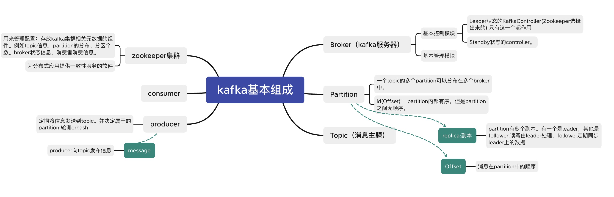
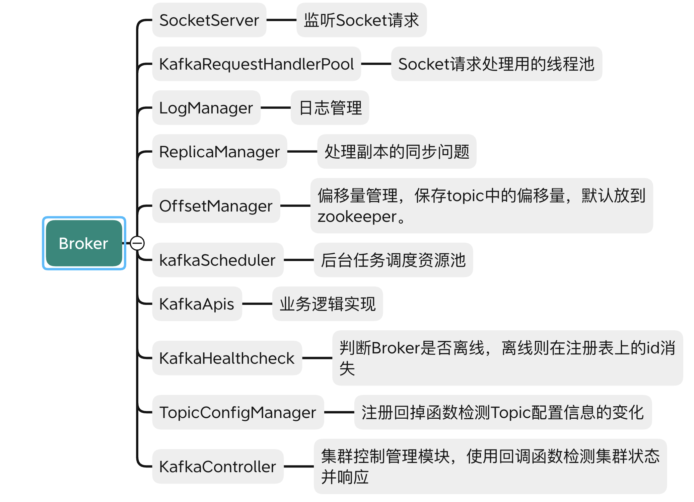

@参考文献：《kafka源码解析与实战》、JavaGuide、[博文](https://www.codurance.com/publications/2016/05/16/publish-subscribe-model-in-kafka)

## kafka是什么
Kafka 是一个分布式流式处理平台。提供消息队列，进行**消息传递**；同时也是**日志存储系统**，以日志的形式存储了数据源的所有数据。它本身是多个Broker这种集群运行的，将信息存放在top下的多个partition中，利用offset当作索引进行读取。

优点：
基于 Scala 和 Java 语言开发，设计中大量使用了批量处理和异步的思想，最高可以每秒处理千万级别的消息。

## kafka的应用场景
1. 消息队列 ：建立实时流数据管道，以可靠地在系统或应用程序之间获取数据。
2. 数据处理： 构建实时的流数据处理程序来转换或处理数据流

## kafka基本结构


## Broker中的九大基本模块


## 消息被放到top中的哪个partition中
- If a partition is specified in the record, use it

- If no partition is specified but a key is present choose a partition based on a hash of the key
（item_id as a key. ）

- If no partition or key is present choose a partition in a round-robin fashion

## kafka的队列模型: 发布、订阅

- 点对点：

        将消息发送到queue中。一个消息而言，只会有一个消费者可以消费。当没有消费者可用时，这个消息会被保存直到有一个可用的消费者。

- 发布 - 订阅模型。Pub-Sub）

        producer发布一个信息，消息通过topic广播传递给订阅了topic的所有consumer。


## 消费方法

### 1 简单消费：

用户需要知道待消费的消息位于哪个topic的哪个分区。并且这个分区的replica中的leader（不是follower）位于哪个Broker中。(只有leader可以读写)。 客户端还需要主动跟踪partition的偏移量。

`FetchRequest`可以指定Topic名称、Topic分区、起始偏移量、最大字节数。

> 消息可以重复被消费。

#### 消费者消费流程
1. 获取Topic的partition的元数据
2. 计算出待消费的topic的partition的起始偏移量
3. 向目的端Broker Server发送FetchRequest请求
4. 判断响应是否成功。失败则更新元数据重新计算偏移量offset。成功则消费消息。

### 2 高级消费：
只用知道哪个topic

提供客户端API。通过consumer group的形式管理消息的队列。

注意事项：
1. consumer group消费过的信息不能再次消费。
2. 定时任务，定时将Consumer Group消费详情提交给zookeeper or kafka
3. 客户端通过流Stream的形式消费消息。每个Stream一个线程来消费。
4. Stream从多个Partition读取数据，不会保证数据间的顺序。
5. 支持负载均衡。

#### 流程
1. 设置topic和stream的映射关系。开启n个stream获取消息
2. 开启n个线程消费stream中的消息

## 一些问题：

### 多分区（Partition）以及多副本（Replica）的好处

Kafka 通过给特定 Topic 指定多个 Partition, 而各个 Partition 可以分布在不同的 Broker 上, 这样便能提供比较好的并发能力（负载均衡）。
Partition 可以指定对应的 Replica 数, 这也极大地提高了消息存储的安全性, 提高了容灾能力，不过也相应的增加了所需要的存储空间。

### Zookeeper在kafka的的作用

ZooKeeper 主要为 Kafka 提供元数据的管理的功能。

1. Broker 注册 ：在 Zookeeper 上会有一个专门用来进行 Broker 服务器列表记录的节点，记录ip和端口
2. Topic 注册 ： 在 Kafka 中，同一个Topic 的消息会被分成多个分区并将其分布在多个 Broker 上，这些分区信息及与 Broker 的对应关系也都是由 Zookeeper 在维护。
3. 负载均衡 ：上面也说过了 Kafka 通过给特定 Topic 指定多个 Partition, 而各个 Partition 可以分布在不同的 Broker 上, 这样便能提供比较好的并发能力。 对于同一个 Topic 的不同 Partition，Kafka 会尽力将这些 Partition 分布到不同的 Broker 服务器上。

### 保证有序的方法：
1 个 Topic 只对应一个 Partition。降低负载均衡的效率。

```java
// spring中kafka的使用案例。
// 使用一个callback确保发送成功
ListenableFuture<SendResult<String, Object>> future = kafkaTemplate.send(topic, o);
future.addCallback(result -> logger.info("生产者成功发送消息到topic:{} partition:{}的消息", result.getRecordMetadata().topic(), result.getRecordMetadata().partition()),
    ex -> logger.error("生产者发送消失败，原因：{}", ex.getMessage()));
```

### 消息丢失的情况

产生原因：消费者消费后会自动提交Offset。因为读写只和partition leader交互。如果partition的leader挂了，需要选择replica中的一个作为leader。这时会有消息丢失。

解决办法：

1. 设置 `acks = all`。代表收到多少个ack才算消息被成功发送。acks 的默认值即为1，代表我们的消息被leader副本接收之后就算被成功发送。当我们配置 acks = all 代表则所有副本都要接收到该消息之后该消息才算真正成功被发送。

2. 设置 `replication.factor >= 3`；为了保证 leader 副本能有 follower 副本能同步消息，我们一般会为 topic 设置 replication.factor >= 3。这样就可以保证每个 分区(partition) 至少有 3 个副本。虽然造成了数据冗余，但是带来了数据的安全性。

3. `min.insync.replicas > 1`。代表消息至少要被写入到 2 个副本才算是被成功发送。