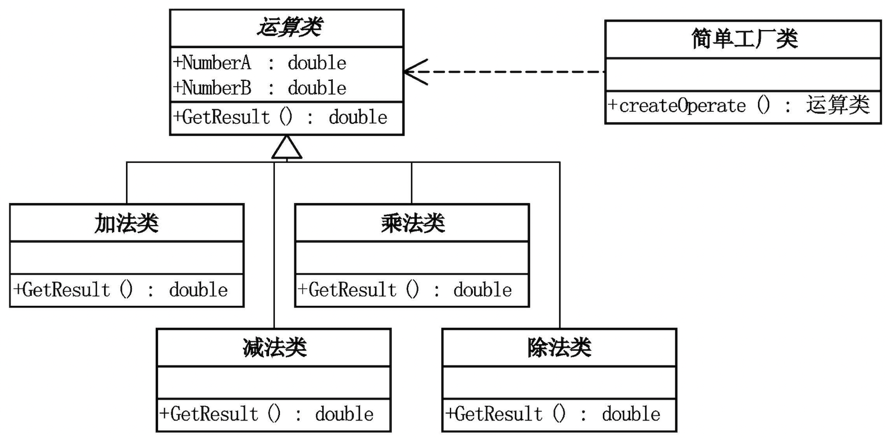
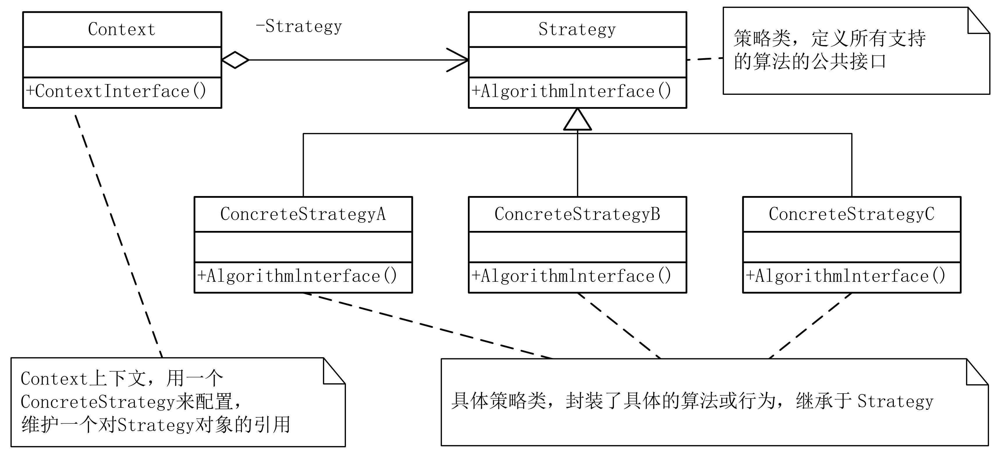

# 简单工厂模式

> 解决的是对象的创建问题。

使用一个Factory类，根据功能判断具体用的是父类的哪个子类。然后返回这个子类。

客户端（main）承接工厂传递的子类后，调用子类中的override公共方法。
`Operator ope; ope = AddOperator(); return ope;`



# 策略模式



> 以特定方式执行一个操作（或一组操作）, 多态地更改类的行为。策略模式可以和工厂模式结合，可以在创建后进行一个执行的操作。

封装了一系列算法。可以封装规则，在内部根据不同的规则，处理变化。

# 单例模式

创建型模式。提供了一种创建对象的最佳方式。

    单例类只能有一个实例。
    且是自己创建的。
    可以给所有其他对象提供这个实例。

```java
public class SingleObject {
 
   //创建 SingleObject 的一个对象
   private static SingleObject instance = new SingleObject();
 
   //让构造函数为 private，这样该类就不会被实例化
   private SingleObject(){}
 
   //获取唯一可用的对象
   public static SingleObject getInstance(){
      return instance;
   }
 
   public void showMessage(){
      System.out.println("Hello World!");
   }
}

// 获取对象的方式
public class SingletonPatternDemo {
   public static void main(String[] args) {
 
      //不合法的构造函数
      //编译时错误：构造函数 SingleObject() 是不可见的
      //SingleObject object = new SingleObject();
 
      //获取唯一可用的对象
      SingleObject object = SingleObject.getInstance();
 
      //显示消息
      object.showMessage();
   }
}
```
## 单例模式实现方式

```java
    (1) 懒汉式 ： 
            在【首次调用getInstance方法】时，才创建Instance对象。
            线程不安全。为了使线程安全可以对构造器枷锁synchronized，但是影响效率。
    (2) 饿汉式 ： 
            在【类加载】时创建Instance对象，
            因此线程安全。但是会浪费内存。
    (3) 懒汉式双校验 【书写的注意事项】
            Instance对象 是 static volatile 类型的。
            getInstance() 是 static 方法 。
            构造器私有化。
```


```java
// 1. 懒汉。无法支持多线程
public class Singleton {  
    private static Singleton instance;  
    private Singleton (){}  
  
    public static Singleton getInstance() {  
    if (instance == null) {  
        instance = new Singleton();  
    }  
    return instance;  
    }  
}

/**
* 2. 懒汉，线程安全。
* 必须加锁 synchronized 才能保证单例，但加锁会影响效率。
**/
public class Singleton {  
    private static Singleton instance;  
    private Singleton (){}  
    public static synchronized Singleton getInstance() {   // 区别是这里加了synchronized
    if (instance == null) {  
        instance = new Singleton();  // 初始化放在构造器里
    }  
    return instance;  
    }  
}


/**
* 3. 饿汉式
* 没有加锁，执行效率会提高。
* 没有lazy初始化，容易产生垃圾对象。类加载时就初始化，浪费内存。
**/
public class Singleton {  
    private static Singleton instance = new Singleton();  // 类加载时初始化
    private Singleton (){}  
    public static Singleton getInstance() {  
    return instance;  
    }  
}

/**
* 4. 双检锁/双重校验锁（DCL，即 double-checked locking）
* 采用双锁机制，安全且在多线程情况下能保持高性能。
**/
public class Singleton {  
    private volatile static Singleton singleton; // Instance对象 是 static volatile 类型的。
    private Singleton (){}  
    public static Singleton getSingleton() {  // getInstance() 是 static 方法 。
    if (singleton == null) {  
        synchronized (Singleton.class) {  // 只有在初始化的时候才会加锁synchronized
        if (singleton == null) {  // 检测其他线程是否先获取锁创建了单例对象
            singleton = new Singleton();  
        }  
        }  
    }  
    return singleton;  
    }  
}
```
> 饿汉式它基于 classloader 机制避免了多线程的同步问题。classloader 机制：


# 参考

1.《大话设计模式》读笔
2. 菜鸟教程
3. [有道云笔记](https://note.youdao.com/ynoteshare/index.html?id=3fa30656141202169d7d99c632b261c5&type=notebook&_time=1631692521806#/A146B11BABEA47EDB396A2877BDEF000)

