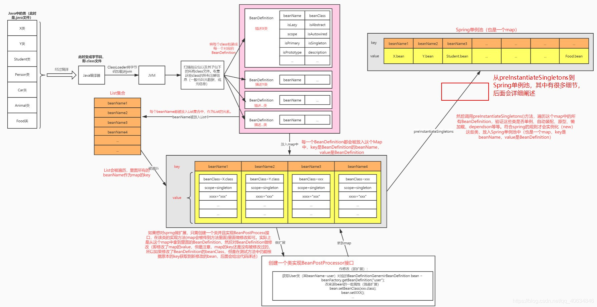

# Bean的生命周期

首先Bean就是Java对象+BeanDefinition。
Bean的生命周期就是

1. ApplicationContext加载注解
2. 实例化
3. 属性注入
4. 初始化
5. 销毁

实例化过程：

详细版本的Bean生命周期：

    1. 启动spring容器,也就是创建beanFactory(bean工厂),
     一般用的是beanFactory的子类applicationcontext,
     applicationcontext比一般的beanFactory要多很多功能,比如aop、事件等。
     通过applicationcontext加载配置文件,或者利用注解的方式扫描将bean
     的配置信息加载到spring容器里面。

    2. 加载之后,spring容器会将这些配置信息(java bean的信息),封装成BeanDefinition对象
      BeanDefinition对象其实就是普通java对象之上再封装一层, 赋予一些spring框架需要用到的属性,比如是否单例,是否懒加载等等。

    3. 将这些BeanDefinition对象以key为beanName,
     值为BeanDefinition对象的形式存入到一个map里面,
     将这个map传入到spring beanfactory去进行springBean的实例化。

    4. 传入到pring beanfactory之后,利用BeanFactoryPostProcessor接口这个扩展点去对BeanDefinition对象进行一些属性修改。

    5. 循环BeanDefinition对象进行SpringBean实例化，实例化就是执行Bean的构造方法。在执行实例化的前后,可以通过InstantiationAwareBeanPostProcessor扩展点(作用于所有bean)进行一些修改。

    6. 属性注入：自定义的属性@AutoWire, 再调用各种Aware接口扩展方法,注入属性(spring特有的属性), 比如BeanNameAware.setBeanName,设置Bean的ID或者Name;

    7. 初始化bean, 属性赋值。初始化前后执行BeanPostProcessor (作用于所有bean)扩展点方法,对bean进行修改。

    8. 此时已完成bean的初始化,在程序中就可以通过spring容器拿到这些初始化好的bean。

    9. 随着容器销毁,springbean也会销毁,销毁前后也有一系列的扩展点。销毁bean之前,执行@PreDestroy 的方法。销毁时,执行配置文件或注解中指定的 destroy-method 方法。