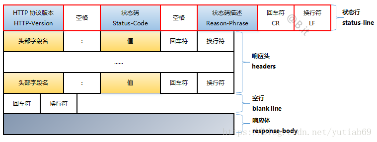

@Author: zzy

@Reference: 1. 实验室师兄师姐总结的知识点
2. [参考文章](https://songlee24.github.io/2015/05/03/public-key-and-private-key/)
3. [参考文章](https://zhuanlan.zhihu.com/p/43789231)

# 几个名词
nginx, rpc, http, 服务发现

# 计算网模型

1. 七层：物理、数据链路、网络、传输、会话（数据格式转换）、表示、应用
2. 四层：网络接口、网络、传输、应用

## 1 应用层
> 常问问题：
> http, https相关：区别，传输加密方式，
> 浏览器访问页面的过程
> http0,http1,2区别，
> 连接过程
> http, get post区别
> cookie， session区别
> 常用协议 DNS, http, https, FTP
> http常见返回值
> http是基于TCP的

### http, https相关：

#### 区别
1. 是否明文传输（需要对称加密）
2. 是否会验证通信方身份。（非对称签名）
3. 是否验证报文完整性，防止被篡改（hash，数字签名）

HTTP + 加密 + 认证 + 完整性保护 = HTTPS
（以上三点就是SSL协议干的事情）

证书：公钥、签名、签名算法、证书颁发机构、过期时间
私钥：签名。 公钥：验证签名

### ssl和tsl区别
ssl:  TCP/IP协议与各种应用层协议之间，为数据通讯提供安全支持. tSL是更安全的升级版 SSL

#### 公钥、私钥、对称、非对称

每个用户都有一对私钥和公钥。

- **私钥用来进行解密和签名**，是给自己用的。
- **公钥由本人公开，用于加密和验证签名**，是给别人用的。
- 当该用户发送文件时，用私钥签名，别人用他给的公钥解密，可以保证该信息是由他发送的。即数字签名。
- 当该用户接受文件时，别人用他的公钥加密，他用私钥解密，可以保证该信息只能由他看到。即安全传输。

##### 公钥私钥谁加密谁解密：

> 公开密钥密码学（英语：Public-key cryptography）也称非对称式密码学。需要一对公钥和私钥。公钥用作加密，私钥则用作解密; 签名：钥负责签名，公钥负责验证。那肯定是不希望有人冒充我发消息，只有我才能发布这个签名。

#### https传输加密方式（连接过程）

- 某网站拥有用于非对称加密的公钥A、私钥A’。
- 浏览器向网站服务器请求，服务器把公钥A通过**CA证书**给传输浏览器。（证书保证公钥不被窃取，数字签名保证证书的真）
- 浏览器随机生成一个用于对称加密的密钥X，用公钥A加密后传给服务器。
- 服务器拿到后用私钥A’解密得到密钥X。
- 这样双方就都拥有密钥X了，且别人无法知道它。之后双方所有数据都通过密钥X加密解密即可。

#### 数据完整性验证（数字签名）：

服务器在发送报文之前做了3件的事：
- 用hash算法对报文提取定长摘要（长度保证固定，速度更快）
- 用私钥对摘要进行加密，作为数字签名
- 将数字签名附加到报文末尾发送给客户端

客户端接收到报文后：
- 用公钥对服务器的数字签名进行解密
- 用同样的算法重新计算出报文的数字签名
- 比较解密后的签名与自己计算的签名是否一致，如果不一致，说明数据被篡改过。

(总结：对称加密的密钥是相同的，部分公私。传输数据用。而一开始的公钥私钥是针对非对称加密，由服务器颁布，发送给浏览器公钥，为了用公钥给对称加密的密钥加密。这样，服务器安全拿到对称加密的密钥后，后面的传输就都可以使用对称加密了。

数字签名是用来验证ca证书的可靠和信息完整。)

### GET POST区别
1. 作用：GET一般从服务器获取资源，POST有可能改变服务器的资源
2. 位置：GET在URL上，在HTTP请求头，post在请求体中
3. 安全性：GET数据可能被缓存、保留到历史记录，且在url是明文。post的参数不被保存
4. 数据格式：GET只能ASCII, POST对数据类型没有要求。允许二进制数据
5. 长度限制：GET长度有限制。

### 浏览器访问页面的过程

1. url合法性判断
2. 协议判断：http or https, get or post,
3. DNS域名解析，得到ip（本地DNS服务器开始，得不到就找到更高级别的DNS域名服务器。
4. TCP建立连接。
5. http传输数据
6. html, css文件渲染

### http0,http1,2区别
http 1.0
- 每次请求都重新建立tcp连接。发送完http就断开tcp连接。
- 断链接：在一次消息交互（发请求-收响应）之后立刻断开。客户端接受到响应后，立即发送FIN消息，主动释放连接。
- 长链接：只有使用keep-alive

http 1.1 (开始支持长链接)
- 无状态协议，引入了post
- 长链接：默认支持：握手成功后不立即断开，而在此基础上进行多次消息。
- 串行处理：tcp连接一次处理一个请求
- 支持只发送header信息(不带任何body信息)，如果服务器认为客户端有权限请求服务器，则返回100，否则返回401。客户端如果接受到100，才开始把请求body发送到服务器。这样当服务器返回401的时候，客户端就可以不用发送请求body了，节约了带宽。

http 2.0（开始多路复用，一个tcp同一时刻可处理多个请求）
- 多路复用：一个链接并发处理多个请求。
- 数据压缩：将header的数据进行压缩

### http常见返回值

100: 临时的相应。请求的初始部分已经被服务器收到，并且没有被服务器拒绝。客户端应该发送下一部分
1. 成功2xx：成功处理已经请求了的状态码
200:成功处理并提供请求页面。204:成功处理没有返回

2. 重定向3xx：

URL重定向：url转发。网页被迁移到新的url时，通过转发，保持原有的链路可用。
304: 如果网页自请求者上次请求后没有更新，则用304代码告诉搜索引擎机器人，可节省带宽和开销。
> 假如我要每天爬取苹果应该商店的app，那么我会在第一次请求的时候吧每个网页的上次修改时间存到数据库（也就是If-Modified-Since）。然后在我第二次爬取的时候，我会把上次存到数据库的时间放到headers里面，如果http状态码返回304,则表示网页没有更新，我可以不用再次解析网页，这样会节约大量时间

3. 客户端错误4xx：
400：服务器不理解请求的语法。语义有误 or 参数有误
401: 没有权限
403: 服务器拒绝请求
404: 服务器找不到请求的页面
410: 资源永久删除

4. 服务器错误5xx
500: 服务器错误
503: 服务器无法使用，超载或者用户停机

### cookie， session区别
cookie: 客户端保存。客户的身份证。cookie中存放sessionId

session: 服务端保存。客户档案表。通过检索cookie中的Sessionid查看客户端对应的哪个session, 来看状态，用来跟踪用户。存在集群、数据库文件中。

流程：服务端发送的响应报文中，set-cookie的首部字段，通知客户端保存cookie。下次客户端发送请求时，会带着cookie一起。服务端发现后，判断是哪个客户端发来的。对比服务器上的session，直到之前的状态信息。

关系：**Session需要使用Cookie作为识别标志**，来解决http无状态的问题。

- if只用cookie不用session: 账户信息全部存放在客户端。不安全，且增加传输带宽，客户端也没那么多地方存储。

- if只用session不用cookie, 无法跟踪用户信息，因为http是无状态的

## 2 表示层

> 常用问题
> 计算机编码与表示方式的不同
不同计算机体系结构使用的数据表示方式不同。例如某些PC使用的是ASCII

## 3 会话层
> 常问问题：
> 作用

使应用建立和维持会话。提供校验点，使从校验点恢复通信。

## 4 传输层
> 常问问题：
> 协议：tcp, udp区别
> tcp保持可靠的方式
> 三次握手四次挥手以及原因
> tcp粘包

是实现两个用户进程间端到端的可靠通信，处理数据包的错误，数据包的次序，以及一些其他关键传输问题。

涉及到服务使用的端口，主机根据端口号识别服务，区分会话。
> 查看端口+IP的方法：`netstat -n`
### tcp udp 区别与场景

1. 面相连接
2. 可靠（序号保证顺序、不重复，ack保证不丢失、超时重传、流量控制、拥塞控制）
3. 点对点
4. 开销

场景：
udp: 即时通信：视频、音频等多媒体通信。广播
tcp: 效率低准确性高的场景：邮件tfp、http

### tcp保持可靠的方式：
1. 顺序：tcp报文有序列号，对失序数据重新排序
2. 重复：丢弃重复的数据
3. 应答不丢失：收到数据后会有确认：方法

        ARQ协议，即自动重传请求。超时+确认。如果超过某一时间没有收到确认帧，则重新发送。发送方收到确认帧后才往后滑动。

4. 超时重传：发送后，发送方启动超时器。超时重传。
5. 流量控制：接收端能接受发送方的数据而不发生溢出

#### 流量控制
滑动窗口来实现。解决发送方和接收方速度不匹配的问题。控制发送方的发送速度从而让接受者来得及接受。

滑动窗口分成接受窗口和发送窗口。发送方和接收方都维护一个发送和接受的序号。

接收方告知发送方自己的窗口大小，控制发送速度。

发送方根据收到ACK当中的期望收到的下一个字节的序号n以及窗口m，还有当前已经发送的字节序号x，算出还可以发送的字节数。

#### 拥塞控制

拥塞窗口来实现实现，防止网络负载过大。原理：发送方维护一个发送窗口，根据情况动态调整大小。

- 慢开始：（小于门限阈值时，）从1开始。发送方每收到一个对新报文段的确认时，就把拥塞窗口cwnd的值加一。这样，下一个传输轮次的大小是上次的两倍。
- 拥塞避免：每经过一个往返时间RTT就把发送方的拥塞窗口cwnd加1
- 快重传：一旦收到三个连续的重复确认，就立即重传。而不是等到接受方发送数据（发送数据会捎带确认）。
- 快恢复：当发现有数据丢失时，门限阈值和拥塞窗口都设置成当前窗口的一半。

### 三次握手四次挥手

syn = 1, seq = j。  SYN = 1，ack = j+1, seq = k
ack = K+1

三次握手的原因：服务端可能会误以为连接，从而服务端发数据，但是客户端没有接受。（长时间滞留的请求信息突然到达，服务端被打开）

四次握手等待的意义：防止server没有收到最有要求关闭连接的ACK。
| client|server|
|---|---|
|fin = 1, seq = j.|  ack = j+1, seq = k(此时close_wait)|
|                 | fin = 1, ack = j+1, seq = w|
|ack = w+1, seq = j+1| | 

>描述：某个应用进程首先调用close主动关闭连接，这时TCP发送一个FIN M；另一端接收到FIN M之后，执行被动关闭，对这个FIN进行确认。它的接收也作为文件结束符传递给应用进程，因为FIN的接收意味着应用进程在相应的连接上再也接收不到额外数据；一段时间之后，接收到文件结束符的应用进程调用close关闭它的socket。这导致它的TCP也发送一个FIN N；接收到这个FIN的源发送端TCP对它进行确认。

CLOSE_WAIT：
在被动关闭连接情况下，在已经接收到对方发来的FIN，但是还没有发送自己的FIN的时刻，连接处于CLOSE_WAIT状态。（这段时间在把自己到对方的这个方向的剩余数据发完）

TIME_WAIT: client发送完最后的ack，等到2MSL（max segment lifetime）再关闭。防止server没有收到最有要求关闭连接的ACK。

### SSO单点登录
在多个应用系统中，只需要登录一次，就可以访问其他相互信任的应用系统。

> 当用户第一次访问应用系统1的时候，因为还没有登录，会被引导到认证系统中进行登录；根据用户提供的登录信息，认证系统进行身份校验，如果通过校验，应该返回给用户一个认证的凭据－－ticket；用户再访问别的应用的时候就会将这个ticket带上，作为自己认证的凭据，应用系统接受到请求之后会把ticket送到认证系统进行校验，检查ticket的合法性。如果通过校验，用户就可以在不用再次登录的情况下访问应用系统2和应用系统3了。

## 5 网络层

完成主机之间报文传输

## 6 数据链路层

完成帧的传输

> 查看mac的方法：`ipconfig`

## 一些组成

http、TP, TCP报文组成

http请求报文与相应报文组成：

> http请求报文： （请求行+请求头）+ 空行 + 请求体

请求行：请求方法（get/post/update/delete），URI, http协议版本号
请求头：key-value: host, accept, cookie， accept-encoding: gzip .. accept-language

空行

请求体：

> http相应报文： （状态行+响应头） + 空行 + 响应体

状态行：http协议版本（http/1.1） + 状态码 + 状态码说明

响应头：Content-Encoding, Content-Length, Content-Type(json, txt)

tcp报文：

## 其他问题

3.2.1什么是三次握手⭐⭐⭐⭐⭐

3.2.2为什么三次握手中客户端还要发送一次确认呢？可以二次握手吗？⭐⭐⭐⭐

    两次则不能保证 客户端收到了服务端的信息（最后一次是客户端发出的）。原因：滞留的从客户端发来的链接信息被收到后，客户端本身已经close了，服务端还在等待客户端发送的信息，浪费服务端的资源。

3.2.3为什么服务端易受到SYN攻击？⭐⭐⭐⭐

    server收到大量的syn后会发送大量的syn的ack包，这些ack包长期占用连接队列，导致正常的syn因为队列满了而被丢弃。

3.2.4什么是四次挥手⭐⭐⭐⭐⭐

3.2.5为什么客户端最后还要等待2MSL？⭐⭐⭐⭐

    客户端发送给服务端的ack可能丢失，等待这时间是为了重发报文。server没有收到ack会重新发送FIN

3.2.6为什么建立连接是三次握手，关闭连接确是四次挥手呢？⭐⭐⭐⭐

URI（统一资源标识符）和URL（统一资源定位符）之间的区别⭐⭐

为什么post发两次请求，get只有一次tcp链接请求。

    GET产生一个TCP数据包；POST产生两个TCP数据包。
    GET方式的请求，浏览器会把http header和data一并发送出去，服务器响应200（返回数据）；
    而对于POST，浏览器先发送header，服务器响应100 continue，浏览器再发送data，服务器响应200 ok（返回数据）

每一层的各种协议

    应用层：FTP, http, https, dns
    会话、表示
    传输：tcp, udp, ARQ(auto repeat request自动重传请求):
    网络：ip, ARP(address resolution)地址解析,根据ip转换为物理mac地址，icmp(网络控制报文)在ip主机与路由器传输控制信息，例如网络是否可达。等。NAT: 网络地址转换。
    数据链路:PPP 点对点协议，csma/cd 载波侦听多路访问，传输之前通过载波侦听，如果没问题不冲突再发送。